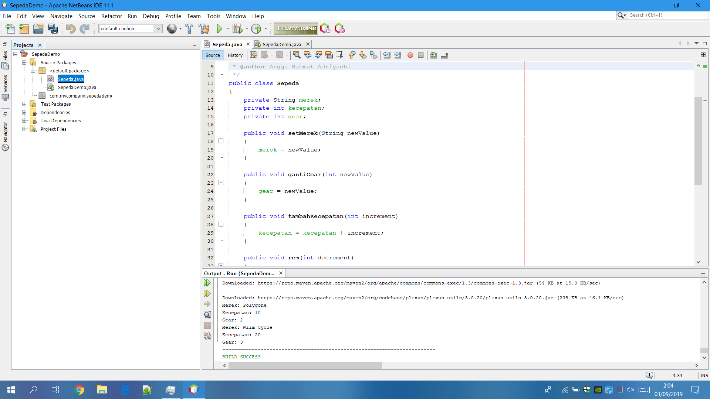
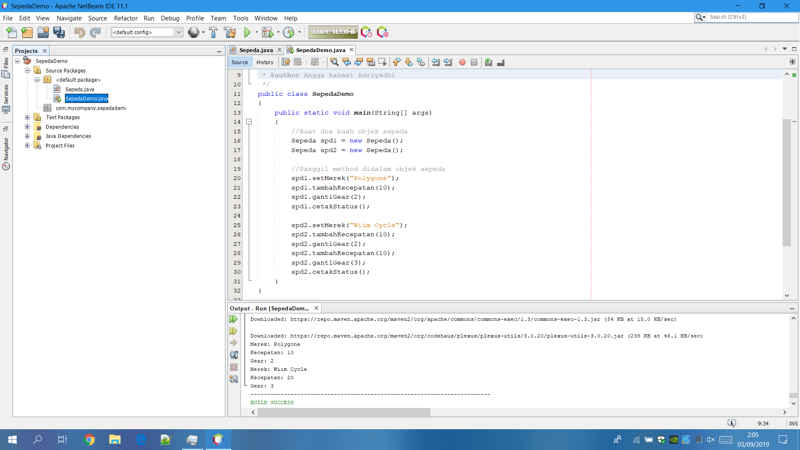
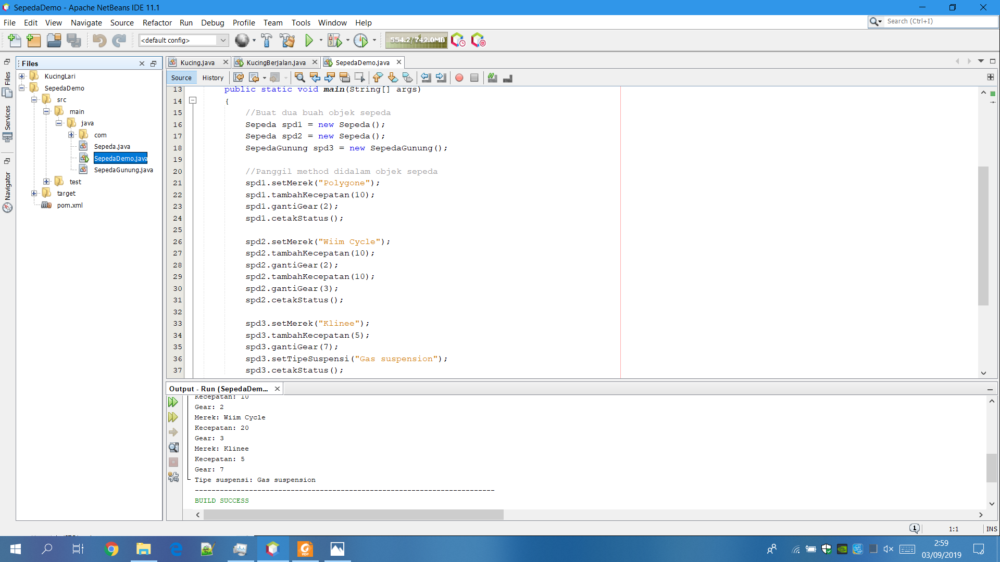
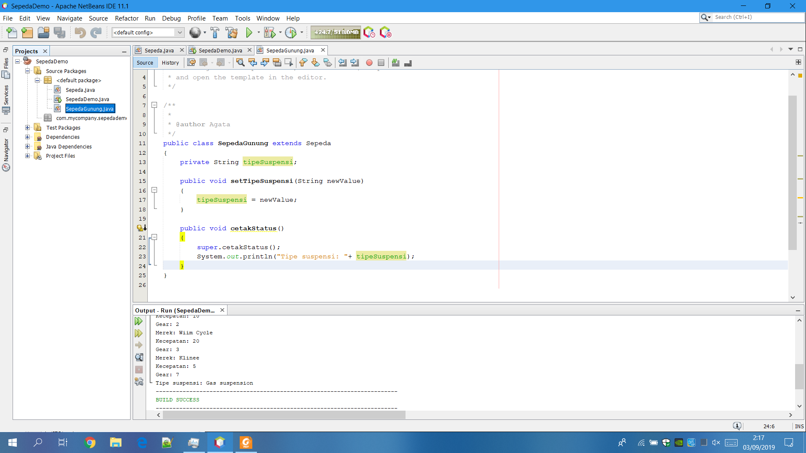
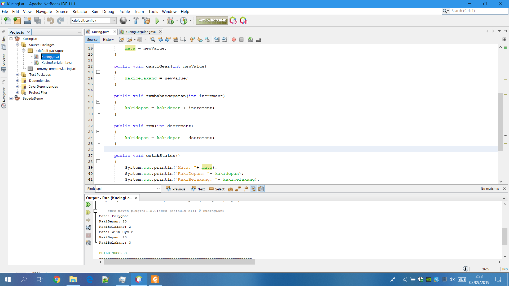
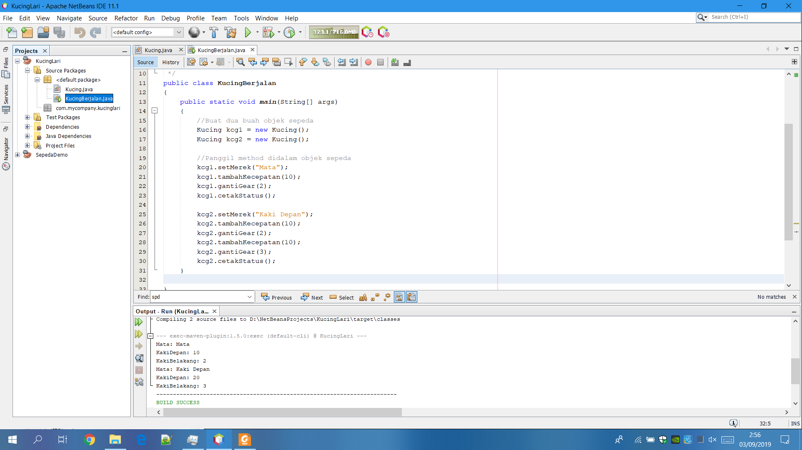
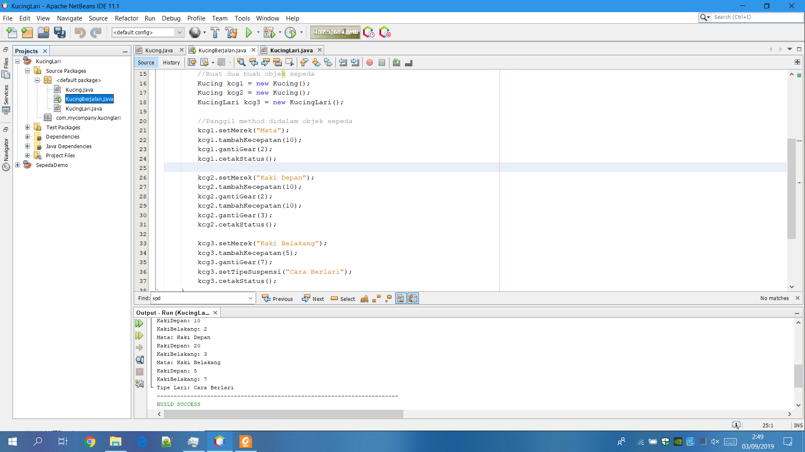

# Laporan Praktikum #1 - Pengantar Konsep PBO

## Kompetensi

Setelah menempuh materi percobaan ini, mahasiswa mampu mengenal:
1. Perbedaan paradigma berorientasi objek dengan paradigma struktural
2. Konsep dasar PBO

## Ringkasan Materi

class adalah sebuah proyek yang tidak dapat di compire. 

main class adalah objek atau hasil jadi class yang dapat di compire dan terima hasilnya tanpa adanya mainclass,class tidak dapat berjalan/tidak dapat di compire

## Percobaan

### Percobaan 1

(Dengan adanya class,main class sebaik Primery Key dapat di panggil untuk mengcompire hasil yang lebih baik dari pada hanya tertuju pada class saja tanpa adanya main class. Jika ada rujukan ke file program, bisa dibuat linknya di sini.)

Screenshot Sepeda.java
 
Screenshot Sepeda.java

Contoh link kode program : [ini contoh link ke Sepeda.java](../../src/1_Pengantar_Konsep_PBO/Sepeda.java) 
Contoh link kode program : [ini contoh link ke SepedaDemo.java](../../src/1_Pengantar_Konsep_PBO/SepedaDemo.java)

### Percobaan 2

(Dengan adanya extand class pada main class,hasil yang di compire deri sebuah class dapat lebih jelas dan hasilnya lebih mendetail. Jika ada rujukan ke file program, bisa dibuat linknya di sini.)

Screenshot SepedaDemo.java Setelah Di tambah Extand Source Code SepedaGunung.java
 
Screenshot SepedaGunung.java

Contoh link kode program : [ini contoh link ke SepedaGunung.java](../../src/1_Pengantar_Konsep_PBO/SepedaGunung.java)

## Pertanyaan

(1. Sebutkan dan jelaskan aspek-aspek yang ada pada pemrograman berorientasi objek!  
    Jawab : 
    Kelas     — kumpulan atas definisi data dan fungsi-fungsi dalam suatu unit untuk suatu tujuan tertentu. 
    Objek     — membungkus data dan fungsi bersama menjadi suatu unit dalam sebuah program komputer; objek merupakan dasar dari                         modularitas dan struktur dalam sebuah program komputer berorientasi objek. 
    Abstraksi — Kemampuan sebuah program untuk melewati aspek informasi yang diproses olehnya, yaitu kemampuan untuk memfokus pada inti. 
    
2. Apa yang dimaksud dengan object dan apa bedanya dengan class?  
   Jawab : 
   Objek adalah hasil dari suatu rancangan/class yang dapat di compire 
   class adalah suatu rancangan untuk menghasilkan sebuah objek yang tidak dapat di compire
   
3. Sebutkan salah satu kelebihan utama dari pemrograman berorientasi objek dibandingkan
   dengan pemrograman struktural!  
   Jawab : 
  —Meningkatkan produktivitas 
   Class dan Object pada PBO yang dibuat untuk suatu problem masih dapat dipakai lagi untuk problem lainnya yang menggunakan objek          tersebut (reusable).

4. Pada class Sepeda, terdapat state/atribut apa saja?  
   Jawab : 
   class,objek,attribute,atribute private,overloading methods
   
5. Tambahkan atribut warna pada class Sepeda.  
   Jawab : 
   
    
6. Mengapa pada saat kita membuat class SepedaGunung, kita tidak perlu membuat class nya dari
nol? 
   Jawab: 
   karena class SepedaGunung adalah extandsi attribute yang di pakai sebagai penambahan source code pada SepedaDemo untuk menambahkan      hasil yang lebih mendetail.)

## Tugas

Screenshot Kucing.java
 
Screenshot KucingBerjalan.java
 
Screenshot KucingBerjalan.java Setelah Di tambah Extand Source Code KucingLari.java
 
Screenshot KucingLari.java

Contoh link kode program : [ini contoh link ke kode program](../../src/1_Pengantar_Konsep_PBO/Kucing.java) 
Contoh link kode program : [ini contoh link ke kode program](../../src/1_Pengantar_Konsep_PBO/KucingBerjalan.java) 
Contoh link kode program : [ini contoh link ke kode program](../../src/1_Pengantar_Konsep_PBO/KucingLari.java)

## Kesimpulan

(Kesimpulan dari pratikum di atas adalah : class adalah sebuah rancang untuk memanggil sebuah main class yang telah di buat karena tanpa adanya class/sebuah rancangan maka mainclass/objek rancangan tidak bisa di panggil atau di jalankan,dengan menambahkan extand class kita dapat membuat sebuah hasil rancangan/objek menjadi lebih detail atau lebih sempurna hasilnya karena dengan extand class hasil dari objek yang di buat oleh class dapat lebih terperinci)

## Pernyataan Diri

Saya menyatakan isi tugas, kode program, dan laporan praktikum ini dibuat oleh saya sendiri. Saya tidak melakukan plagiasi, kecurangan, menyalin/menggandakan milik orang lain.

Jika saya melakukan plagiasi, kecurangan, atau melanggar hak kekayaan intelektual, saya siap untuk mendapat sanksi atau hukuman sesuai peraturan perundang-undangan yang berlaku.

Ttd,

***(Angga Rahmat Adriyadhi)***
