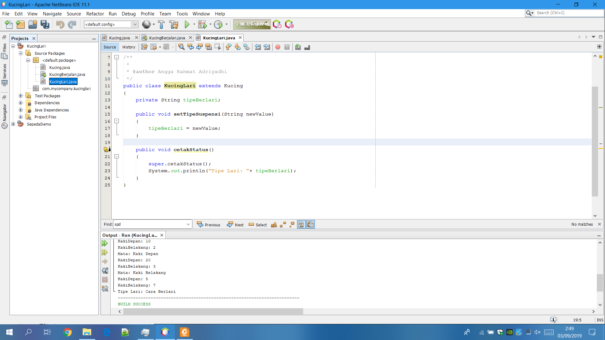

# Laporan Praktikum #1 - Pengantar Konsep PBO

## Kompetensi

(Jobseet 1 Pratikum PBO)

## Ringkasan Materi

(berisi catatan penting pribadi selama praktikum berlangsung ataupun menemukan permasalahan khusus saat melakukan percobaan)

## Percobaan

### Percobaan 1

(berisi penjelasan percobaan 1. Jika ada rujukan ke file program, bisa dibuat linknya di sini.)

Screenshot Sepeda.java
 
Screenshot Sepeda.java

Contoh link kode program : [ini contoh link ke Sepeda.java](../../src/1_Pengantar_Konsep_PBO/Sepeda.java) 
Contoh link kode program : [ini contoh link ke SepedaDemo.java](../../src/1_Pengantar_Konsep_PBO/SepedaDemo.java)

### Percobaan 2

(berisi penjelasan percobaan 2. Jika ada rujukan ke file program, bisa dibuat linknya di sini.)

Screenshot SepedaDemo.java Setelah Di tambah Extand Source Code SepedaGunung.java
 
Screenshot SepedaGunung.java

Contoh link kode program : [ini contoh link ke SepedaGunung.java](../../src/1_Pengantar_Konsep_PBO/SepedaGunung.java)

## Pertanyaan

(1. Sebutkan dan jelaskan aspek-aspek yang ada pada pemrograman berorientasi objek!  
2. Apa yang dimaksud dengan object dan apa bedanya dengan class?  
3. Sebutkan salah satu kelebihan utama dari pemrograman berorientasi objek dibandingkan
dengan pemrograman struktural!  
4. Pada class Sepeda, terdapat state/atribut apa saja?  
5. Tambahkan atribut warna pada class Sepeda.  
6. Mengapa pada saat kita membuat class SepedaGunung, kita tidak perlu membuat class nya dari
nol?)

## Tugas

(silakan kerjakan tugas di sini beserta `screenshot` hasil kompilasi program. Jika ada rujukan ke file program, bisa dibuat linknya di sini.)

Screenshot Kucing.java
 
Screenshot KucingBerjalan.java
 
Screenshot KucingBerjalan.java Setelah Di tambah Extand Source Code KucingLari.java
 
Screenshot KucingLari.java

Contoh link kode program : [ini contoh link ke kode program](../../src/1_Pengantar_Konsep_PBO/Kucing.java) 
Contoh link kode program : [ini contoh link ke kode program](../../src/1_Pengantar_Konsep_PBO/KucingBerjalan.java) 
Contoh link kode program : [ini contoh link ke kode program](../../src/1_Pengantar_Konsep_PBO/KucingLari.java)

## Kesimpulan

(Kesimpulan dari pratikum di atas adalah : class adalah sebuah rancang untuk memanggil sebuah main class yang telah di buat karena tanpa adanya class/sebuah rancangan maka mainclass/objek rancangan tidak bisa di panggil atau di jalankan,dengan menambahkan extand class kita dapat membuat sebuah hasil rancangan/objek menjadi lebih detail atau lebih sempurna hasilnya karena dengan extand class hasil dari objek yang di buat oleh class dapat lebih terperinci)

## Pernyataan Diri

Saya menyatakan isi tugas, kode program, dan laporan praktikum ini dibuat oleh saya sendiri. Saya tidak melakukan plagiasi, kecurangan, menyalin/menggandakan milik orang lain.

Jika saya melakukan plagiasi, kecurangan, atau melanggar hak kekayaan intelektual, saya siap untuk mendapat sanksi atau hukuman sesuai peraturan perundang-undangan yang berlaku.

Ttd,

***(Angga Rahmat Adriyadhi)***
