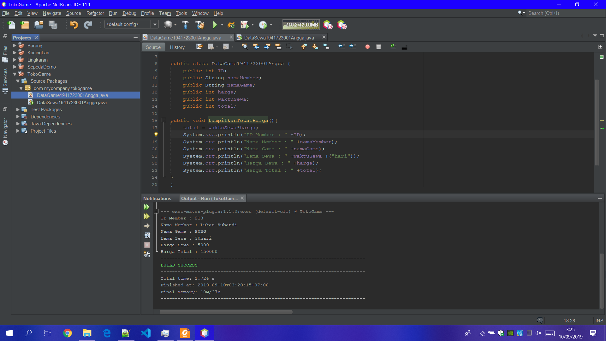
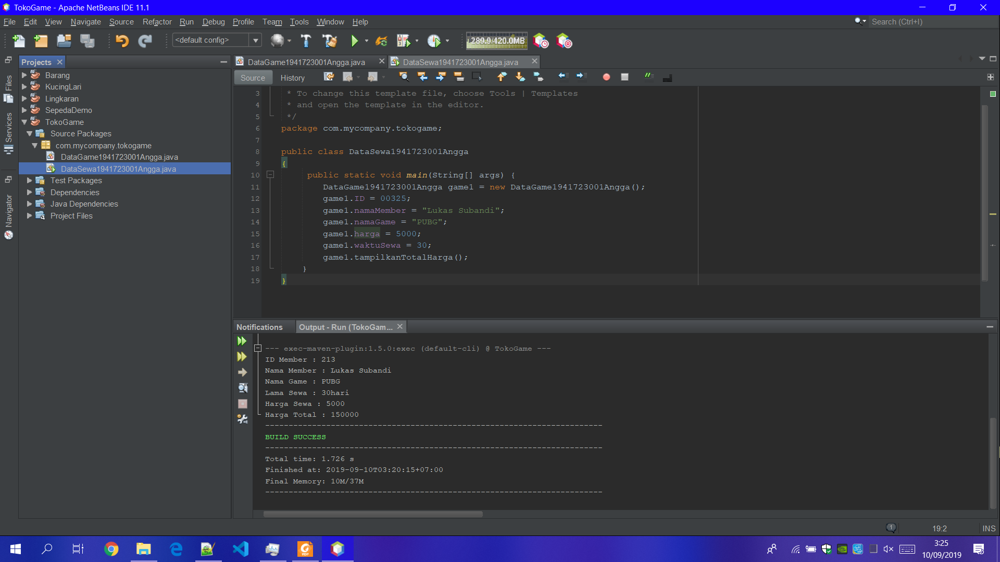
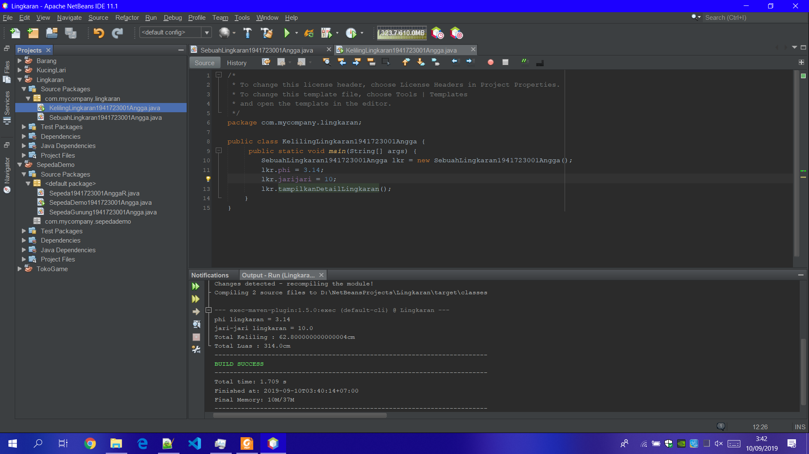
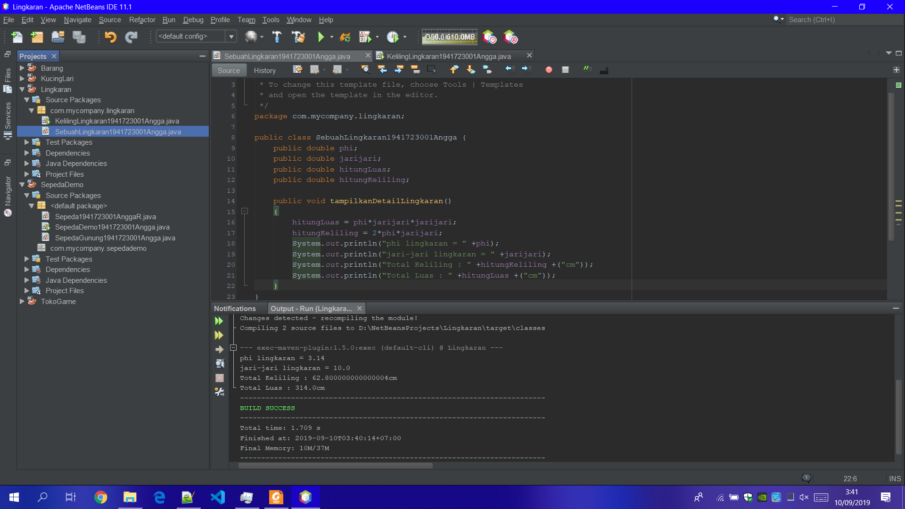
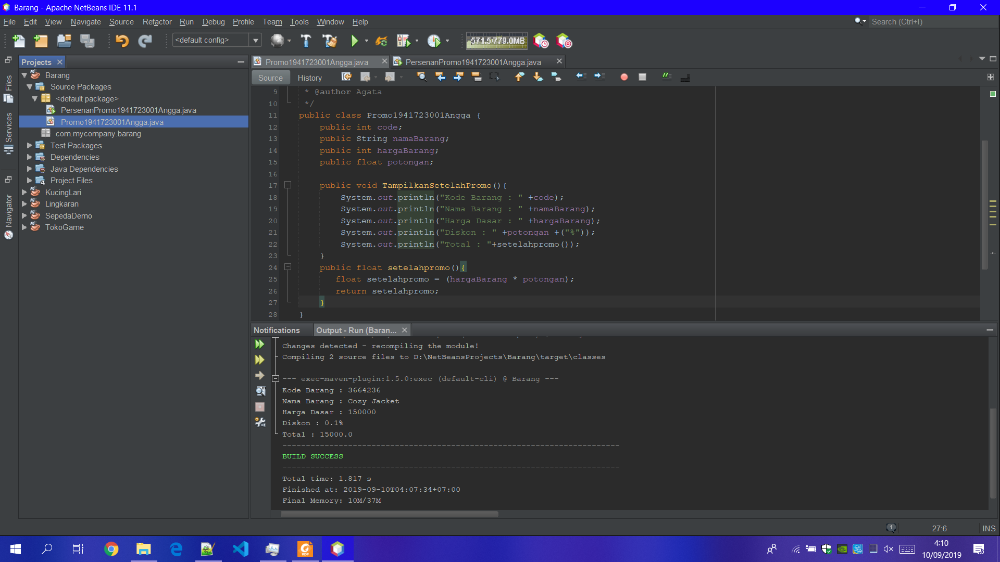

 Laporan Praktikum #1 - Pengantar Konsep PBO

## Kompetensi

•	Mahasiswa dapat memahami deskripsi dari class dan object  
•	Mahasiswa memahami implementasi dari class  
•	Mahasiswa dapat memahami implementasi dari attribute  
•	Mahasiswa dapat memahami implementasi dari method 
•	Mahasiswa dapat memahami implementasi dari proses instansiasi 
•	Mahasiswa dapat memahami implementasi dari try-catch  
•	Mahasiswa dapat memahami proses pemodelan class diagram menggunakan UML  

## Ringkasan Materi

Secara singkat class adalah abstraksi dari sebuah object (nyata ataupun tdk nyata) (roger s pressman). Apabila kita ingin membuat class mahasiswa, maka kita perlu melakukan abstraksi (mengindikasi bagian – bagian penting yang merepresentasikan benda itu sendiri) dari object mahasiswa itu sendiri.

## Percobaan

### Percobaan 1

Dengan adanya class,main class sebaik Primery Key dapat di panggil untuk mengcompire hasil yang lebih baik dari pada hanya tertuju pada class saja tanpa adanya main class.

Screenshot DataGame.java
 
Screenshot DataSewa.java

link kode program : [ini link ke DataGame.java](../../src/2_Class_Dan_Objek/DataGame1941723001Angga.java) 
link kode program : [ini link ke SepedaDemo.java](../../src/2_Class_Dan_Objek/DataSewa1941723001Angga.java)

### Percobaan 2

Dengan adanya extand class pada main class,hasil yang di compire deri sebuah class dapat lebih jelas dan hasilnya lebih mendetail. Jika ada rujukan ke file program, bisa dibuat linknya di sini.

Screenshot KelilingLingkaran.java Setelah Di tambah Extand Source Code SepedaGunung.java
 
Screenshot SepedaGunung.java

link kode program : [ini link ke SepedaGunung.java](../../src/2_Class_Dan_Objek/KelilingLingkaran1941723001Angga.java) 
link kode program : [ini link ke SepedaGunung.java](../../src/2_Class_Dan_Objek/SebuahLingkaran1941723001Angga.java)

## Tugas

Screenshot Promo.java
 
Screenshot Persenanpromo.java
! screenshot](img/Persenanpromo.png) 

 link kode program : [ini link ke kode program](../../src/2_class_dan_objek/Promo1941723001Angga.java)  link kode program : [ini link ke kode program](../../src/2_class_dan_objek/Persenanpromo1941723001Angga.java)

## Kesimpulan

Kesimpulan dari pratikum di atas adalah : class adalah sebuah rancang untuk memanggil sebuah main class yang telah di buat karena tanpa adanya class/sebuah rancangan maka mainclass/objek rancangan tidak bisa di panggil atau di jalankan,dengan menambahkan extand class kita dapat membuat sebuah hasil rancangan/objek menjadi lebih detail atau lebih sempurna hasilnya karena dengan extand class hasil dari objek yang di buat oleh class dapat lebih terperinci.

## Pernyataan Diri

Saya menyatakan isi tugas, kode program, dan laporan praktikum ini dibuat oleh saya sendiri. Saya tidak melakukan plagiasi, kecurangan, menyalin/menggandakan milik orang lain.

Jika saya melakukan plagiasi, kecurangan, atau melanggar hak kekayaan intelektual, saya siap untuk mendapat sanksi atau hukuman sesuai peraturan perundang-undangan yang berlaku.

Ttd,

***(Angga Rahmat Adriyadhi)***