# Laporan Praktikum #3 - Enkapsulasi

## Kompetensi

    Setelah melakukan percobaan pada modul ini, mahasiswa memahami konsep:
    1. Konstruktor
    2. Akses Modifier
    3. Atribut/method pada class
    4. Intansiasi atribut/method
    5. Setter dan getter
    6. Memahami notasi pada UML Class Diagram

## Ringkasan Materi

    Enkapsukasi disebut juga dengan information-hiding. Dalam berinteraksi dengan objek, seringkali
    kita tidak perlu mengetahui kompleksitas yang ada didalamnya. Hal ini akan lebih mudah dipahami
    jika kita membayangkan atau menganalisa objek yang ada disekitar kita, misalnya objek sepeda,
    ketika kita mengganti gear pada sepeda, kita tinggal menekan tuas gear yang ada di grip setang
    sepeda saja. Kita tidak perlu mengetahui bagaimana cara gear berpindah secara teknis. Contoh objek
    lain misalnya mesin penghisap debu (vacum cleaner), ketika kita mencolokkan kabel vacum cleaner
    dan menyalakan sakelarnya maka mesin tersebut siap digunakan    untuk menghisap debu.

## Konstruktor

    Konstruktor mirip dengan method cara deklarasinya akan tetapi tidak memiliki tipe return. Dan
    konstruktor dieksekusi ketika instan dari objek dibuat. Jadi setiap kali sebuat objek dibuat dengan
    keyword new() maka konstruktor akan dieksekusi. Cara untuk membuat konstruktor adalah sebagai
    berikut:

    1. Nama konstruktor harus sama dengan nama class
    2. Konstruktor tidak memiliki tipe data return
    3. Konstruktor tidak boleh menggunakan modifier abstract, static, final, dan syncronized

## Akses Modifier

    Terdapat 2 tipe modifier di java yaitu : akses modifier dan non-access modifier. Dalam hal ini kita
    akan fokus pada akses modifier yang berguna untuk mengatur akses method, class, dan constructor.
    Terdapat 4 akses modifier yaitu:

    1. private – hanya dapat diakses di dalam kelas yang sama
    2. default – hanya dapat diakses di dalam package yang sama
    3. protected – dapat diakases di luar package menggunakan subclass (membuat inheritance)
    4. public – dapat diakases dari mana saja

## Percobaan

## Percobaan 1 
Enkapsulasi

    Didalam percobaan enkapsulasi, buatlah class Motor yang memiliki atribut kecepatan dan kontakOn,
    dan memiliki method printStatus() untuk menampilkan status motor. Seperti berikut.

    1. Buka Netbeans, buat project MotorEncapsulation.
    2. Buat class Motor. Klik kanan pada package motorencapsulation – New – Java Class.
    3. Ketikkan kode class Motor dibawah ini.

Screenshot Motor.java
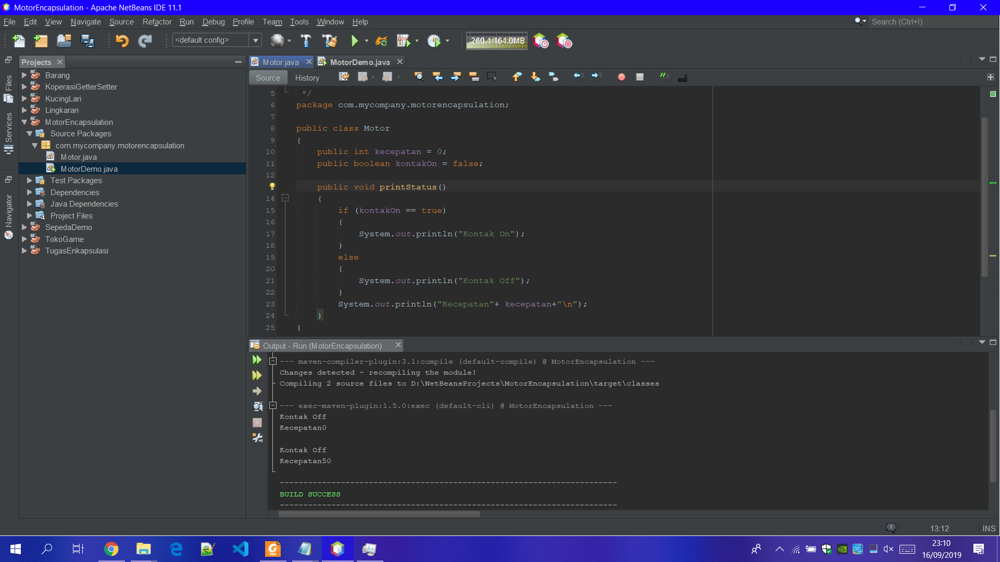

Screenshot MotorDemo.java
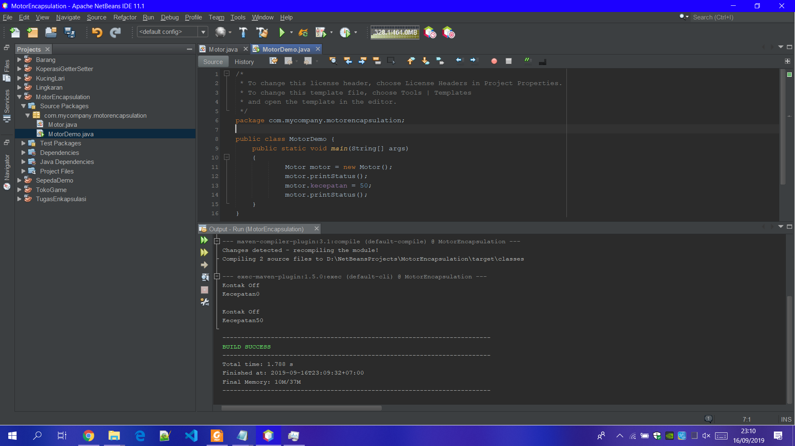

 link kode program : [ini link ke Motor.java](../../src/3_Enkapsulasi/Motor1941723001Angga.java)
 
 link kode program : [ini link ke MotorDemo.java](../../src/3_Enkapsulasi/MotorDemo1941723001Angga.java)

    Dari percobaan 1 - enkapsulasi, menurut anda, adakah yang janggal?
    Yaitu, kecepatan motor tiba-tiba saja berubah dari 0 ke 50. Lebih janggal lagi, posisi kontak motor
    masih dalam kondisi OFF. Bagaimana mungkin sebuah motor bisa sekejap berkecepatan dari nol ke
    50, dan itupun kunci kontaknya OFF?
    Nah dalam hal ini, akses ke atribut motor ternyata tidak terkontrol. Padahal, objek di dunia nyata
    selalu memiliki batasan dan mekanisme bagaimana objek tersebut dapat digunakan. Lalu,
    bagaimana kita bisa memperbaiki class Motor diatas agar dapat digunakan dengan baik? Kita bisa
    pertimbangkan beberapa hal berikut ini:

    1. Menyembunyikan atribut internal (kecepatan, kontakOn) dari pengguna (class lain)
    2. Menyediakan method khusus untuk mengakses atribut.
    Untuk itu mari kita lanjutkan percobaan berikutknya tentang Access Modifier.

## Percobaan 2
Access Modifier

Dengan adanya extand class pada main class,hasil yang di compire deri sebuah class dapat lebih jelas dan hasilnya lebih mendetail. Jika ada rujukan ke file program, bisa dibuat linknya di sini.

Screenshot Motor.java
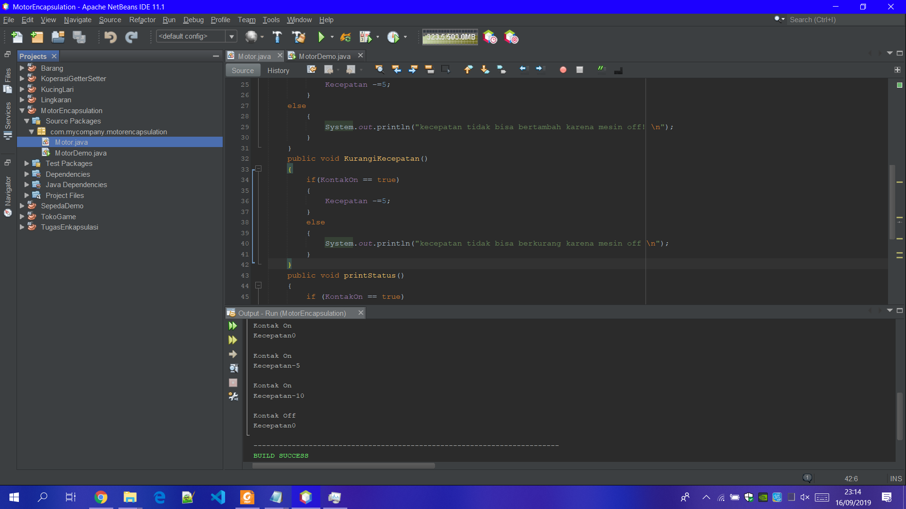

Screenshot MotorDemo.java
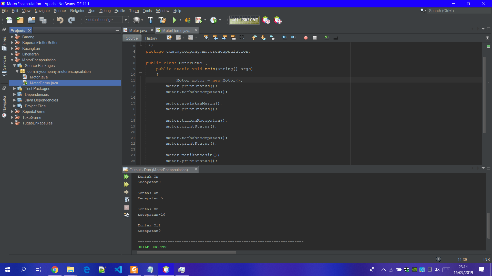

link kode program : [ini link ke Motor.java](../../src/3_Enkapsulasi/Motor1941723001Angga.java)
 
link kode program : [ini link ke MotorDemo.java](../../src/3_Enkapsulasi/MotorDemo1941723001Angga.java)

## Pertanyaan

    1. Pada class TestMobil, saat kita menambah kecepatan untuk pertama kalinya, mengapa
    muncul peringatan “Kecepatan tidak bisa bertambah karena Mesin Off!”?

    Jawab:karena di saat mesin dalam keadaan off maka kecepatan tidak akan bisa di tambahkan 

    2. Mengapat atribut kecepatan dan kontakOn diset private?

    Jawab:agar query yang berjalan tidak saling bertabrakan sehingga build dapat di jalankan dengan sempurna hingga succesbuild

    3. Ubah class Motor sehingga kecepatan maksimalnya adalah 100!

## Percobaan 3
Getter dan Setter

Misalkan di sebuah sistem informasi koperasi, terdapat class Anggota. Anggota memiliki atribut
nama, alamat dan simpanan, dan method setter, getter dan setor dan pinjam. Semua atribut pada
anggota tidak boleh diubah sembarangan, melainkan hanya dapat diubah melalui method setter,
getter, setor dan tarik. 

    1. Sama dengan percobaan 1 untuk membuat project baru
    a. Buka Netbeans, buat project KoperasiGetterSetter.
    b. Buat class Anggota. Klik kanan pada package koperasigettersetter – New – Java
    Class.
    c. Ketikkan kode class Anggota dibawah ini.

Screenshot Anggota.java
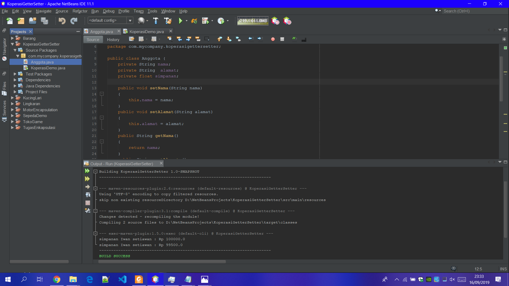

Screenshot KoperasiDemo.java
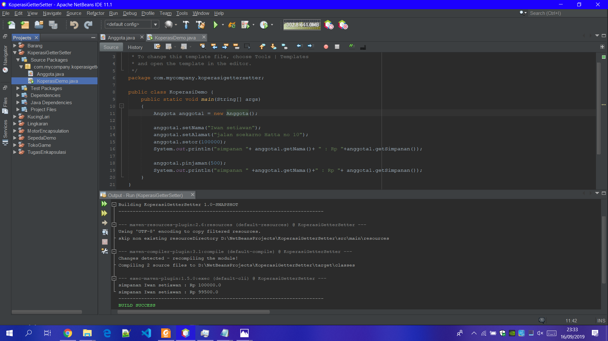

link kode program : [ini link ke Anggota.java](../../src/3_Enkapsulasi/Anggota1941723001Angga.java)
 
link kode program : [ini link ke KoperasiDemo.java](../../src/3_Enkapsulasi/KoperasiDemo1941723001Angga.java)

## Percobaan 4  
Konstruktor, Instansiasi

Screenshot KoperasiDemo.java

Screenshot Anggota.java
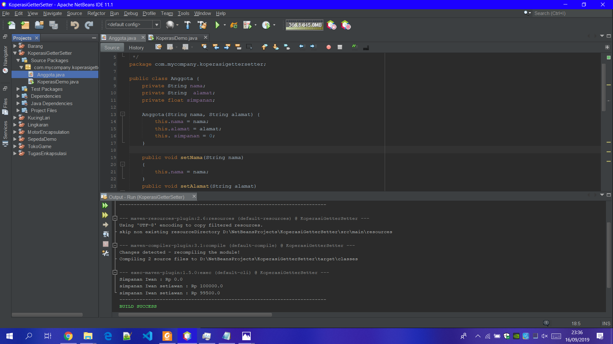

## Pertanyaan 
    Percobaan 3 dan 4
    1. Apa yang dimaksud getter dan setter?
    Jawab: dua method yang tugasnya untuk mengambil dan mengisi data ke dalam objek.

    2. Apa kegunaan dari method getSimpanan()?
    Jawab: untuk mengirimkan nilai variabel ke halaman lain atau mengirimkan ke database dan mengambil nilai variabel dari halaman lain atau mengambil data pada database.

    3. Method apa yang digunakan untk menambah saldo?
    Jawab:  public void setor(float uang)
            {
            simpanan +=uang;
            }

    4. Apa yand dimaksud konstruktor?
    Jawab: Konstruktor mirip dengan method cara deklarasinya akan tetapi tidak memiliki tipe return.

    5. Sebutkan aturan dalam membuat konstruktor?
    Jawab:  1. Nama konstruktor harus sama dengan nama class
            2. Konstruktor tidak memiliki tipe data return
            3. Konstruktor tidak boleh menggunakan modifier abstract, static, final, dan syncronized

    6. Apakah boleh konstruktor bertipe private?
    Jawab: tidak boleh

    7. Kapan menggunakan parameter dengan passsing parameter?
    Jawab: pengiriman parameter yang dilakukan dengan mengcopykan value dari actual parameter (dari pemanggil/caller) ke formal parameter (function).

    8. Apa perbedaan atribut class dan instansiasi atribut?
    Jawab: Class merupakan suatu blueprint atau cetakan untuk menciptakan suatu instant dari object.

    Sedangkan instansiasi atribut adalah merupakan nilai data yang terdapat pada suatu object yang berasal dari class.

    9. Apa perbedaan class method dan instansiasi method?
    Jawab: method class merupakan bagan atau badan pembetukan suatu objek sedangakan instansiasi method adalah isi dari suatu method class

## Kesimpulan

    Dari percobaan diatas, telah dipelajari kosep dari enkapsulasi, kontruktor, access modifier yang
    terdiri dari 4 jenis yaitu public, protected, default dan private. Konsep atribut atau method class
    yang ada di dalam blok code class dan konsep instansiasi atribut atau method. Cara penggunaan
    getter dan setter beserta fungsi dari getter dan setter. Dan juga telah dipelajari atau memahami
    notasi UML

## Tugas
    1. Cobalah program dibawah ini dan tuliskan hasil outputnya

Screenshot EncapDemo.java
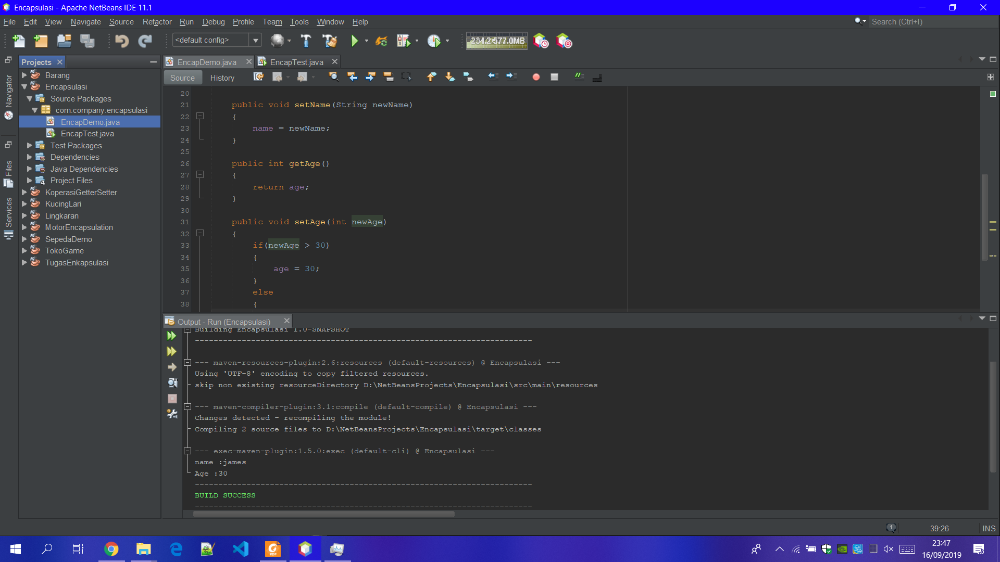

Screenshot EncapTest.java
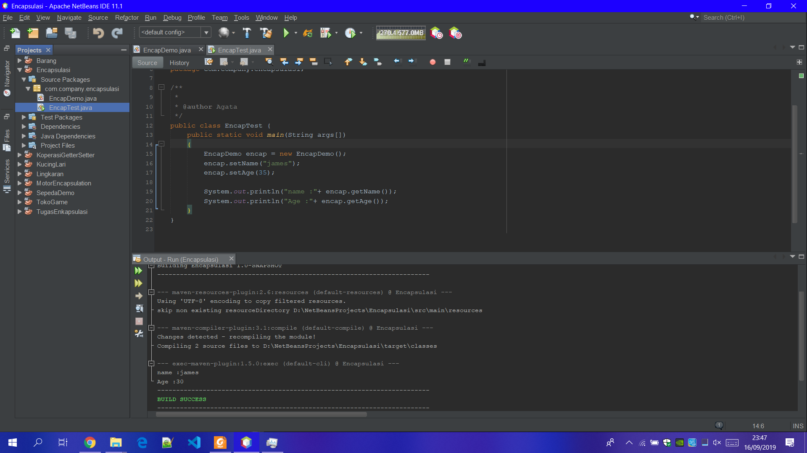

link kode program : [ini link ke EncapDemo.java](../../src/3_Enkapsulasi/EncapDemo1941723001Angga.java)

link kode program : [ini link ke EncapTest.java](../../src/3_Enkapsulasi/EncapTest1941723001Angga.java)

    2. Pada program diatas, pada class EncapTest kita mengeset age dengan nilai 35, namun pada
    saat ditampilkan ke layar nilainya 30, jelaskan mengapa.
    Jawab :

    3. Ubah program diatas agar atribut age dapat diberi nilai  maksimal 30 dan minimal 18.
    Jawab :

    4. Pada sebuah sistem informasi koperasi simpan pinjam, terdapat class Anggota yang memiliki
    atribut antara lain nomor KTP, nama, limit peminjaman, dan jumlah pinjaman. Anggota
    dapat meminjam uang dengan batas limit peminjaman yang ditentukan. Anggota juga dapat
    mengangsur pinjaman. Ketika Anggota tersebut mengangsur pinjaman, maka jumlah
    pinjaman akan berkurang sesuai dengan nominal yang diangsur. Buatlah class Anggota
    tersebut, berikan atribut, method dan konstruktor sesuai dengan kebutuhan. Uji dengan
    TestKoperasi berikut ini untuk memeriksa apakah class Anggota yang anda buat telah sesuai
    dengan yang diharapkan.

        public class TestKoperasi
        {
        public static void main(String[] args)
        {
        Anggota donny = new Anggota("111333444", "Donny", 5000000);
        System.out.println("Nama Anggota: " + donny.getNama());
        System.out.println("Limit Pinjaman: " + donny.getLimitPinjaman());
        System.out.println("\nMeminjam uang 10.000.000...");
        donny.pinjam(10000000);
        System.out.println("Jumlah pinjaman saat ini: " + donny.getJumlahPinjaman());
        System.out.println("\nMeminjam uang 4.000.000...");
        donny.pinjam(4000000);
        System.out.println("Jumlah pinjaman saat ini: " + donny.getJumlahPinjaman());
        System.out.println("\nMembayar angsuran 1.000.000");
        donny.angsur(1000000);
        System.out.println("Jumlah pinjaman saat ini: " + donny.getJumlahPinjaman());
        System.out.println("\nMembayar angsuran 3.000.000");
        donny.angsur(3000000);
        System.out.println("Jumlah pinjaman saat ini: " + donny.getJumlahPinjaman());
        }
        }

    Jawab :
Screenshot Koperasi.java
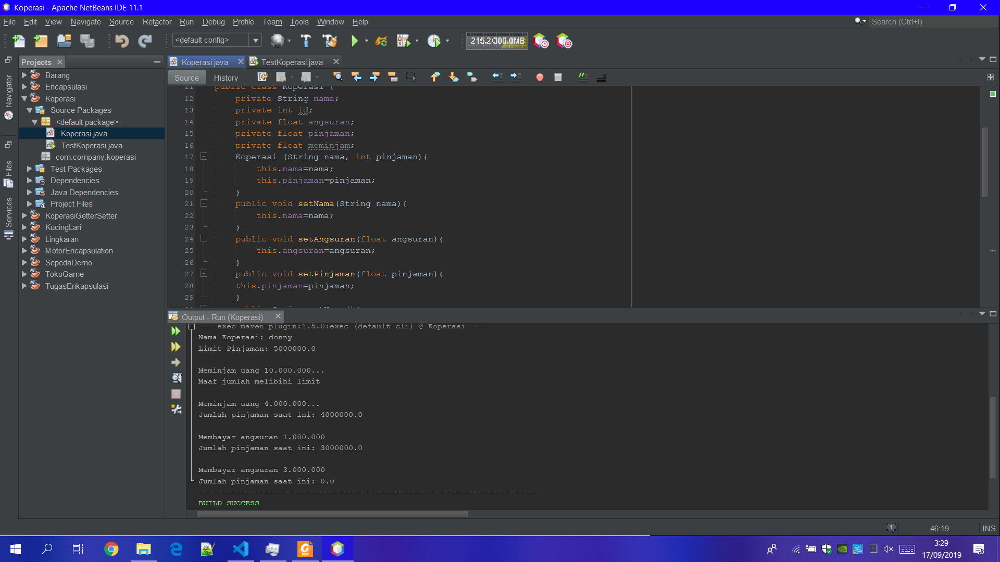

Screenshot TestKoperasi.java
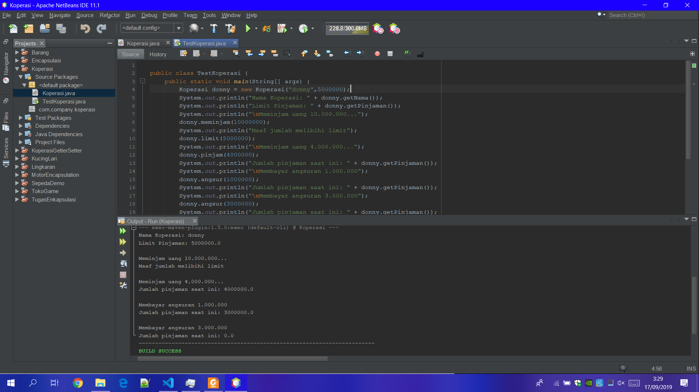

link kode program : [ini link ke Koperasi.java](../../src/3_Enkapsulasi/Koperasi1941723001Angga.java)

link kode program : [ini link ke TestKoperasi.java](../../src/3_Enkapsulasi/TestKoperasi1941723001Angga.java)

    5. Modifikasi soal no. 4 agar nominal yang dapat diangsur minimal adalah 10% dari jumlah
    pinjaman saat ini. Jika mengangsur kurang dari itu, maka muncul peringatan “Maaf,
    angsuran harus 10% dari jumlah pinjaman”.

    Jawab:

    6. Modifikasi class TestKoperasi, agar jumlah pinjaman dan angsuran dapat menerima input
    dari console.

    Jawab:

## Pernyataan Diri

Saya menyatakan isi tugas, kode program, dan laporan praktikum ini dibuat oleh saya sendiri. Saya tidak melakukan plagiasi, kecurangan, menyalin/menggandakan milik orang lain.

Jika saya melakukan plagiasi, kecurangan, atau melanggar hak kekayaan intelektual, saya siap untuk mendapat sanksi atau hukuman sesuai peraturan perundang-undangan yang berlaku.

Ttd,

***(Angga Rahmat Adriyadhi)***
