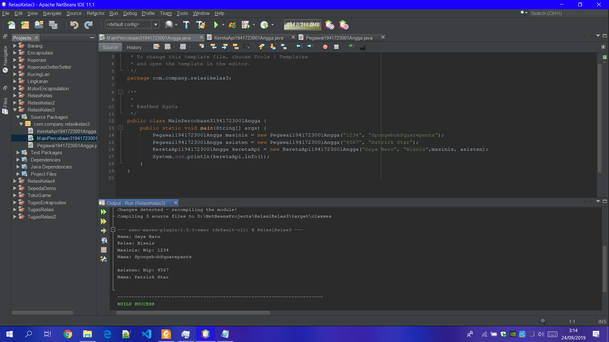

# Laporan Praktikum #4 - Relasi Kelas

   ## Kompetensi

     Setelah menempuh pokok bahasan ini, mahasiswa mampu:
     1. Memahami konsep relasi kelas;
     2. Mengimplementasikan relasi has‑a dalam program.

   ## Ringkasan Materi

      Pada kasus yang lebih kompleks, dalam suatu sistem akan ditemukan lebih dari satu class yang saling memiliki keterkaitan antara class satu dengan yang lain. Pada percobaan‑percobaan sebelumnya, mayoritas kasus yang sudah dikerjakan hanya fokus pada satu class saja. Pada jobsheet ini akan dilakukan percobaan yang melibatkan beberapa class yang saling berelasi.

## Percobaan

### Percobaan 1

    a. Perhatikan diagram class berikut:Page 2 of 10
    b. Buka project baru di Netbeans dan buat package dengan format berikut:
    <identifieer>.relasiclass.percobaan1 (ganti dengan identitas anda atau nama domain), Contoh: ac.id.polinema, jti.polinema, dan sebagainya).
    Catatan: Penamaan package dengan tambahan identifier untuk menghindari adanya kemungkinan penamaan class yang bentrok.

    c. Buatlah class Processor dalam package tersebut.
    public class Processor {}
    d. Tambahkan atribut merk dan cache pada class Processor dengan akses modifier

    private .
    private String merk;
    private double cache;

    e. Buatlah constructor default untuk class Processor.

    f. Buatlah constructor untuk class Processor dengan parameter merk dan cache.

    g. Implementasikan setter dan getter untuk class Processor.

    h. Implementasikan method info() seperti berikut:
    public void info() {
    System.out.printf("Merk Processor = %s\n", merk);
    System.out.printf("Cache Memory = %.2f\n", cache);
    }

    i. Kemudian buatlah class Laptop di dalam package yang telah anda buat.

    j. Tambahkan atribut merk dengan tipe String dan proc dengan tipe Object Processor
    private String merk;
    private Processor proc;Page 3 of 10

    k. Buatlah constructor default untuk class Laptop .
    l. Buatlah constructor untuk class Laptop dengan parameter merk dan proc .

    m. Selanjutnya implementasikan method info() pada class Laptop sebagai berikut:

    public void info() {
    System.out.println("Merk Laptop = " + merk);
    proc.info();
    }

    n. Pada package yang sama, buatlah class MainPercobaan1 yang berisi method main().

    o. Deklarasikan Object Processor dengan nama p kemudian instansiasi dengan informasi atribut Intel i5 untuk nilai merk serta 3 untuk nilai cache . Processor p = new Processor("Intel i5", 3);

    p. Kemudian deklarasikan serta instansiasi Objek Laptop dengan nama L dengan informasi atribut Thinkpad dan Objek Processor yang telah dibuat.

    q. Panggil method info() dari Objek L.
    L.info();

    r. Tambahkan baris kode berikut
    Processor p1 = new Processor();
    p1.setMerk("Intel i5");
    p1.setCache(4);
    Laptop L1 = new Laptop();
    L1.setMerk("Thinkpad");
    L1.setProc(p1);
    L1.info();

    s. Compile kemudian run class MainPercobaan1, akan didapatkan hasil seperti berikut:

### Pertanyaan

    Berdasarkan percobaan 1, jawablah pertanyaan‑pertanyaan yang terkait:

    1. Di dalam class Processor dan class Laptop , terdapat method setter dan getter untuk masing‑masing atributnya. Apakah gunanya method setter dan getter tersebut ?
    Jawab : Sesuai namanya methot setter untuk membuat variable dan methot getter untuk menari atau mengambil variabel yang sudah di buat tadi

    2. Di dalam class Processor dan class Laptop, masing‑masing terdapat konstruktor default dan konstruktor berparameter. Bagaimanakah beda penggunaan dari kedua jenis konstruktor tersebut ?Page 4 of 10
    Jawab: Konstrukktor default merupakan konstruktor tanpa nilai dan konstruktor berparameter memiliki nilai dengan memberi para meter maka nilai dari variabel tidak akan bertabrakan

    3. Perhatikan class Laptop, di antara 2 atribut yang dimiliki (merk dan proc), atribut manakah yang bertipe object ?
    Jawan: Yaitu method Private proc,karena methot tersebut memanggil class sebelumnya yang telah di buat menjadi objek

    4. Perhatikan class Laptop, pada baris manakah yang menunjukan bahwa class Laptop memiliki relasi dengan class Processor ?
    Jawab: Pada baris pembuatan Variabel dengan method private processor

    5. Perhatikan pada class Laptop , Apakah guna dari sintaks proc.info() ?
    Jawab: Sintak tersebut berfungsi sebagai penampil info dasi class laptop yang terlah di buat

    6. Pada class MainPercobaan1, terdapat baris kode:
    Laptop l = new Laptop("Thinkpad", p);. Apakah p tersebut ? 
    Dan apakah yang terjadi jika baris kode tersebut diubah menjadi: 
    Laptop l = new Laptop("Thinkpad", new Processor("Intel i5",3));
    Jawab: p merupakan alias dari method processor,jika mengganti method p sintak diatas maka terjadi eror karena terjadi perulangan konstruktor di dalam variabel tersebut

    Bagaimanakah hasil program saat dijalankan, apakah ada perubahan ?

Screenshot Laptop.java

Screenshot Processor.java

Screenshot MainPercobaan 1.java

link kode program : [ini link ke Laptop.java](../../src/4_Relasi_Kelas/Laptop1941723001Angga.java) 

link kode program : [ini link ke Processor.java](../../src/4_Relasi_Kelas/Processor1941723001Angga.java)

link kode program : [ini link ke MainPercobaan1.java](../../src/4_Relasi_Kelas/MainPercobaan11941723001Angga.java)

### Percobaan 2

    Perhatikan diagram class berikut yang menggambarkan sistem rental mobil. Pelanggan bisa menyewa mobil sekaligus sopir. Biaya sopir dan biaya sewa mobil dihitung per hari.

    a. Tambahkan package <identifier>.relasiclass.percobaan2.

    b. Buatlah class Mobil di dalam package tersebut.

    c. Tambahkan atribut merk tipe String dan biaya tipe int dengan akses modifier
    private.

    d. Tambahkan constructor default serta setter dan getter.

    e. Implementasikan method hitungBiayaMobil
    public int hitungBiayaMobil(int hari) {
    return biaya * hari;
    }

    f. Tambahkan class Sopir dengan atribut nama tipe String dan biaya tipe int dengan akses modifier private berikut dengan constructor default.Page 5 of 10
    g. Implementasikan method hitungBiayaSopir
    public int hitungBiayaSopir(int hari) {
    return biaya * hari;
    }

    h. Tambahkan class Pelanggan dengan constructor default.

    i. Tambahkan atribut‑atribut dengan akses modifier private berikut:
    Atribut Tipe
    nama String
    mobil Mobil
    sopir Sopir
    hari int

    j. Implementasikan setter dan getter.
    
    k. Tambahkan method hitungBiayaTotal
    public int hitungBiayaTotal() {
    return mobil.hitungBiayaMobil(hari) +
    sopir.hitungBiayaSopir(hari);
    }

    l. Buatlah class MainPercobaan2 yang berisi method main(). Tambahkan baris kode
    berikut:
    Mobil m = new Mobil();
    m.setMerk("Avanza");
    m.setBiaya(350000);
    Sopir s = new Sopir();
    s.setNama("John Doe");
    s.setBiaya(200000);
    Pelanggan p = new Pelanggan();
    p.setNama("Jane Doe");
    p.setMobil(m);
    p.setSopir(s);
    p.setHari(2);
    System.out.println("Biaya Total = " +
    p.hitungBiayaTotal());
    m. Compile dan jalankan class MainPercobaan2, dan perhatikan hasilnya!

### Pertanyaan

    1. Perhatikan class Pelanggan. Pada baris program manakah yang menunjukan bahwa class Pelanggan memiliki relasi dengan class Mobil dan class Sopir ?
    
    2. Perhatikan method hitungBiayaSopir pada class Sopir, serta methodhitungBiayaMobil pada class Mobil.Mengapa menurut Anda method tersebut harus memiliki argument hari ?Page 6 of 10
    
    3. Perhatikan kode dari class Pelanggan. Untuk apakah perintah
    mobil.hitungBiayaMobil(hari) dan sopir.hitungBiayaSopir(hari) ?
    
    4. Perhatikan class MainPercobaan2. Untuk apakah sintaks p.setMobil(m) dan
    p.setSopir(s) ?
    
    5. Perhatikan class MainPercobaan2. Untuk apakah proses p.hitungBiayaTotal()
    tersebut ?
    
    6. Perhatikan class MainPercobaan2, coba tambahkan pada baris terakhir dari method main dan amati perubahan saat di‑run!
    System.out.println(p.getMobil().getMerk());
    Jadi untuk apakah sintaks p.getMobil().getMerk() yang ada di dalam method main
    tersebut?

Screenshot Sopir.java

Screenshot Mobil.java

Screenshot Pelanggan.java

Screenshot MainPercobaan2.java

link kode program : [ini link ke MainPercobaan2.java](../../src/4_Relasi_Kelas/MainPercobaan21941723001Angga.java)

link kode program : [ini link ke Mobil.java](../../src/4_Relasi_Kelas/Mobil1941723001Angga.java)

link kode program : [ini link ke Pelanggan.java](../../src/4_Relasi_Kelas/Pelanggan1941723001Angga.java)

link kode program : [ini link ke Sopir.java](../../src/4_Relasi_Kelas/Sopir1941723001Angga.java)

### Percobaan 3

    Pada percobaan‑percobaan sebelumnya, relasi dalam class dinyatakan dalam one‑to‑one. Tetapi ada kalanya relasi class melibatkan lebih dari satu. Hal ini disebut dengan multiplicity. Untuk relasi lebih rinci mengenai multiplicity, dapat dilihat pada tabel berikut.
    Multiplicity Keterangan
    0..1 0 atau 1 instance
    1 Tepat 1 instance
    0..* 0 atau lebih instance
    1..* setidaknya 1 instance
    n Tepat n instance (n diganti dengan sebuah angka)
    m..n Setidaknya m instance, tetapi tidak lebih dari n

    a. Sebuah Kereta Api dioperasikan oleh Masinis serta seorang Asisten Masinis. Baik Masinis maupun Asisten Masinis keduanya merupakan Pegawai PT. Kereta Api Indonesia. Dari ilustrasi cerita tersebut, dapat digambarkan dalam diagram kelas sebagai berikut:

    b. Perhatikan dan pahami diagram kelas tersebut, kemudian bukalah IDE anda!

    c. Buatlah package <identifier.>.relasiclass.percobaan3, kemudian tambahkan class Pegawai.Page 7 of 10

    d. Tambahkan atribut‑atribut ke dalam class Pegawai
    private String nip;
    private String nama;

    e. Buatlah constructor untuk class Pegawai dengan parameter nip dan nama.

    f. Tambahkan setter dan getter untuk masing‑masing atribut.

    g. Implementasikan method info() dengan menuliskan baris kode berikut:
    public String info() { String info = "";
    info += "Nip: " + this.nip + "\n";
    info += "Nama: " + this.nama + "\n";
    return info;
    }

    h. Buatlah class KeretaApi berdasarkan diagram class.

    i. Tambahkan atribut‑atribut pada class KeretaApi berupa nama, kelas, masinis, dan
    asisten.
    private String nama;
    private String kelas;
    private Pegawai masinis;
    private Pegawai asisten;

    j. Tambahkan constructor 3 parameter (nama, kelas, masinis) serta 4 parameter (nama,kelas, masinis, asisten).

    k. Tambahkan setter dan getter untuk atribut‑atribut yang ada pada class KeretaApi .

    l. Kemudian implementasikan method info()
    public String info() {
    String info = "";
    info += "Nama: " + this.nama + "\n";
    info += "Kelas: " + this.kelas + "\n";
    info += "Masinis: " + this.masinis.info() + "\n";
    info += "Asisten: " + this.asisten.info() + "\n";
    return info;
    }

    m. Buatlah sebuah class MainPercobaan3 dalam package yang sama.

    n. Tambahkan method main() kemudian tuliskan baris kode berikut.
    Pegawai masinis = new Pegawai("1234", "Spongebob
    Squarepants");
    Pegawai asisten = new Pegawai("4567", "Patrick Star");Page 8 of 10
    KeretaApi keretaApi = new KeretaApi("Gaya Baru", "Bisnis",
    masinis, asisten);
    System.out.println(keretaApi.info());

## Pertanyaan
    1. Di dalam method info() pada class KeretaApi, baris this.masinis.info() dan this.asisten.info() digunakan untuk apa ?
    Jawab: Untuk menampilkan isi dari atau menampilkan isi dari variabel class masinis dan class asisten
    
    2. Buatlah main program baru dengan nama class MainPertanyaan pada package yang sama. Tambahkan kode berikut pada method main() !
    Pegawai masinis = new Pegawai("1234", "Spongebob
    Squarepants");
    KeretaApi keretaApi = new KeretaApi("Gaya Baru", "Bisnis",masinis);
    System.out.println(keretaApi.info());
     
    3. Apa hasil output dari main program tersebut ? Mengapa hal tersebut dapat terjadi ?
    
    4. Perbaiki class KeretaApi sehingga program dapat berjalan !

Screenshot Pegawai.java

Screenshot KeretaApi.java

Screenshot MainPercobaan3.java

-link kode program : [ini link ke Pegawai.java](../../src/4_Relasi_Kelas/Pegawai1941723001Angga.java)

-link kode program : [ini link ke KeretaApi.java](../../src/4_Relasi_Kelas/KeretaApi1941723001Angga.java)

-link kode program : [ini link ke MainPercobaan3.java](../../src/4_Relasi_Kelas/MainPercobaan31941723001Angga.java)

### Percobaan 4

    a. Perhatikan dan pahami diagram class tersebut.

    b. Buatlah masing‑masing class Penumpang, Kursi dan Gerbong sesuai rancangan tersebut pada package <identifier>.relasiclass.percobaan4.
    
    c. Tambahkan method info() pada class Penumpang
    public String info() {
    String info = "";
    info += "Ktp: " + ktp + "\n";
    info += "Nama: " + nama + "\n";
    return info;
    }Page 9 of 10
    
    d. Tambahkan method info() pada class Kursi
    public String info() {
    String info = "";
    info += "Nomor: " + nomor + "\n";
    if (this.penumpang != null) {
    info += "Penumpang: " + penumpang.info() + "\n";
    }
    return info;
    }
    
    e. Pada class Gerbong buatlah method initKursi() dengan akses private.
    private void initKursi() {
    for (int i = 0; i < arrayKursi.length; i++) {
    this.arrayKursi[i] = new Kursi(String.valueOf(i + 1));
    }
    }
    
    f. Panggil method initKursi() dalam constructor Gerbong sehingga baris kode menjadi
    berikut:
    public Gerbong(String kode, int jumlah) {
    this.kode = kode;
    this.arrayKursi = new Kursi[jumlah];
    this.initKursi();
    }
    
    g. Tambahkan method info() pada class Gerbong
    public String info() {
    String info = "";
    info += "Kode: " + kode + "\n";
    for (Kursi kursi : arrayKursi) {
    info += kursi.info();
    }
    return info;
    }
    
    h. Implementasikan method untuk memasukkan penumpang sesuai dengan nomor kursi.
    public void setPenumpang(Penumpang penumpang, int nomor) {
    this.arrayKursi[nomor - 1].setPenumpang(penumpang);
    }
    
    i. Buatlah class MainPercobaan4 yang berisi method main(). Kemudian tambahkan baris berikut!
    Penumpang p = new Penumpang("12345", "Mr. Krab");
    Gerbong gerbong = new Gerbong("A", 10);
    gerbong.setPenumpang(p, 1);
    System.out.println(gerbong.info());

### Pertanyaan

    1. Pada main program dalam class MainPercobaan4, berapakah jumlah kursi dalam Gerbong A ?
    jawab: Jumlah kursi pada gerbong A berjumlah 10

    2. Perhatikan potongan kode pada method info() dalam class Kursi. Apa maksud kode tersebut ?
    ...
    if (this.penumpang != null) {
    info += "Penumpang: " + penumpang.info() + "\n";
    }
    ...
    Jawab: Jika data penumpang tidak tampil maka nilainya akan berubah menjadi null,info berfungi untuk menampilkan data pada class Kursi
    
    3. Mengapa pada method setPenumpang() dalam class Gerbong, nilai nomor dikurangi dengan angka 1 ?
    Jawab: Untuk mengisi data Kursi persatu bangku
    
    4. Instansiasi objek baru budi dengan tipe Penumpang, kemudian masukkan objek baru tersebut pada gerbong dengan gerbong.setPenumpang(budi, 1). Apakah yang terjadi ?
    Jawab: Yang terjadi adalah Budi akan menduduki kursi penumpang no 1
    
    5. Modifikasi program sehingga tidak diperkenankan untuk menduduki kursi yang sudah ada penumpang lain !

Screenshot Penumpang.java

Screenshot Kursi.java

Screenshot Gerbong.java

Screenshot MainPercobaan4.java

-link kode program : [ini link ke Penumpang.java](../../src/4_Relasi_Kelas/Penumpang1941723001Angga.java)

-link kode program : [ini link ke Kursi.java](../../src/4_Relasi_Kelas/Kursi1941723001Angga.java)

-link kode program : [ini link ke Gerbong.java](../../src/4_Relasi_Kelas/Gerbong1941723001Angga.java)

-link kode program : [ini link ke MainPercobaan4.java](../../src/4_Relasi_Kelas/MainPercobaan41941723001Angga.java)

## Tugas

    Buatlah sebuah studi kasus, rancang dengan class diagram, kemudian implementasikan ke dalam program! Studi kasus harus mewakili relasi class dari percobaan‑percobaan yang telah dilakukan pada materi ini, setidaknya melibatkan minimal 4 class (class yang berisi main tidak dihitung).

Screenshot Bandara.java

Screenshot BeliTiketBerangkat.java

Screenshot BeliTiketPulang.java

Screenshot DataPenumpang.java

Screenshot MainTugasRelasi.java

-link kode program : [ini link ke Bandara.java](../../src/4_Relasi_Kelas/Bandara1941723001Angga.java)

-link kode program : [ini link ke BeliTiketPergi.java](../../src/4_Relasi_Kelas/BeliTiketBerangkat1941723001Angga.java)

-link kode program : [ini link ke BeliTiketPulang.java](../../src/4_Relasi_Kelas/BeliTiketPulang1941723001Angga.java)

-link kode program : [ini link ke DataPenumpang.java](../../src/4_Relasi_Kelas/DataPenumpang1941723001Angga.java)

-link kode program : [ini link ke MainTugasRelasi.java](../../src/4_Relasi_Kelas/MainTugasRelasi1941723001Angga.java)

## Pernyataan Diri

Saya menyatakan isi tugas, kode program, dan laporan praktikum ini dibuat oleh saya sendiri. Saya tidak melakukan plagiasi, kecurangan, menyalin/menggandakan milik orang lain.

Jika saya melakukan plagiasi, kecurangan, atau melanggar hak kekayaan intelektual, saya siap untuk mendapat sanksi atau hukuman sesuai peraturan perundang-undangan yang berlaku.

Ttd,

***(Angga Rahmat Adriyadhi)***
