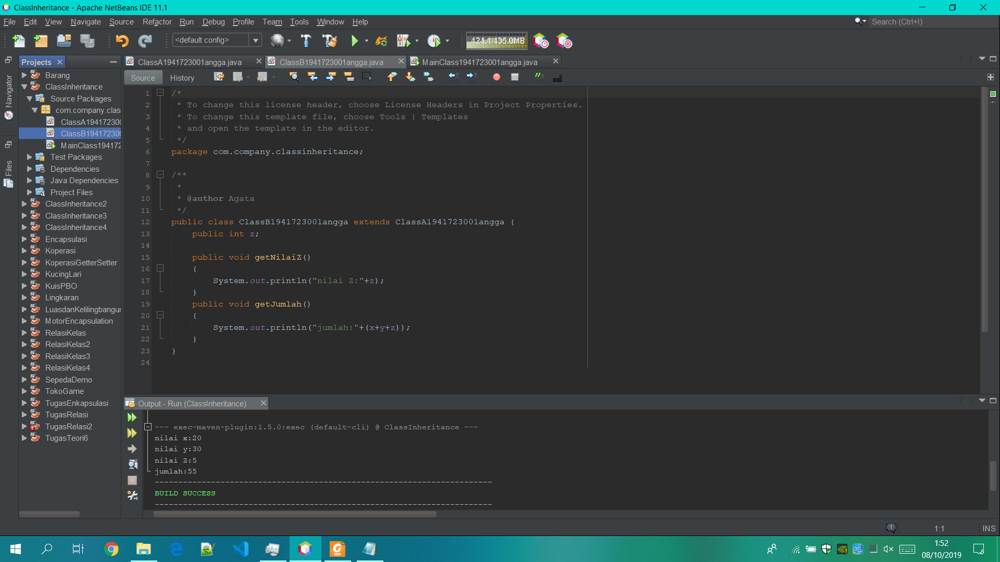
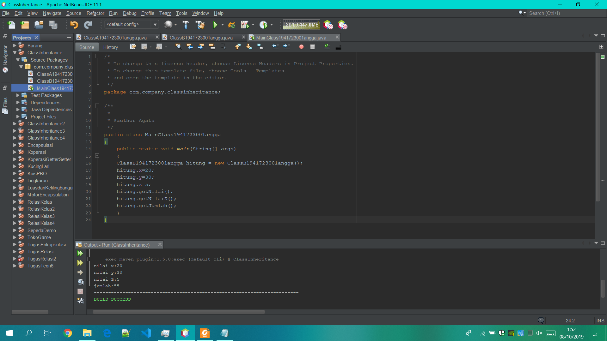
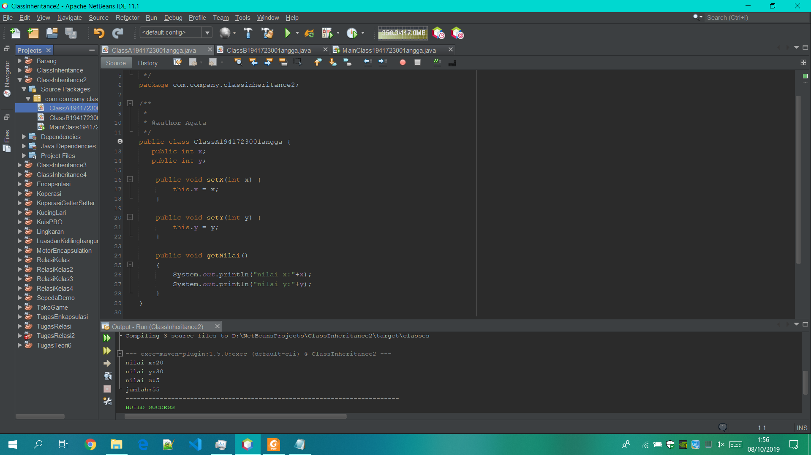
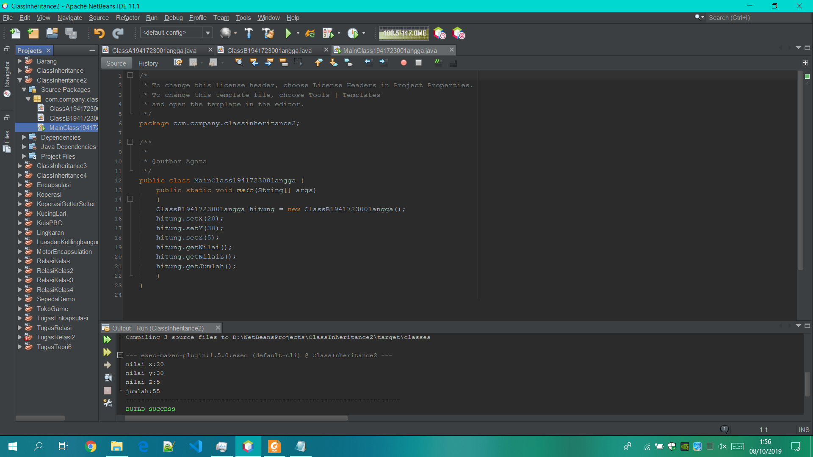
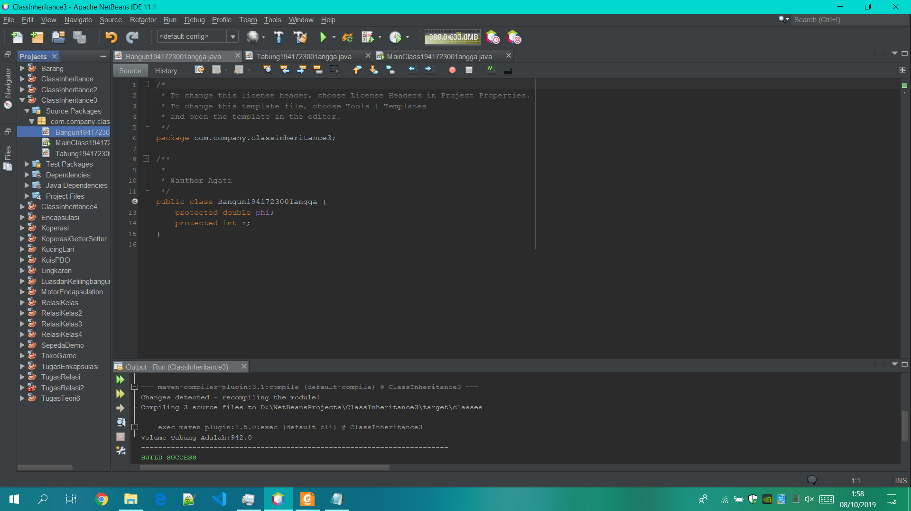
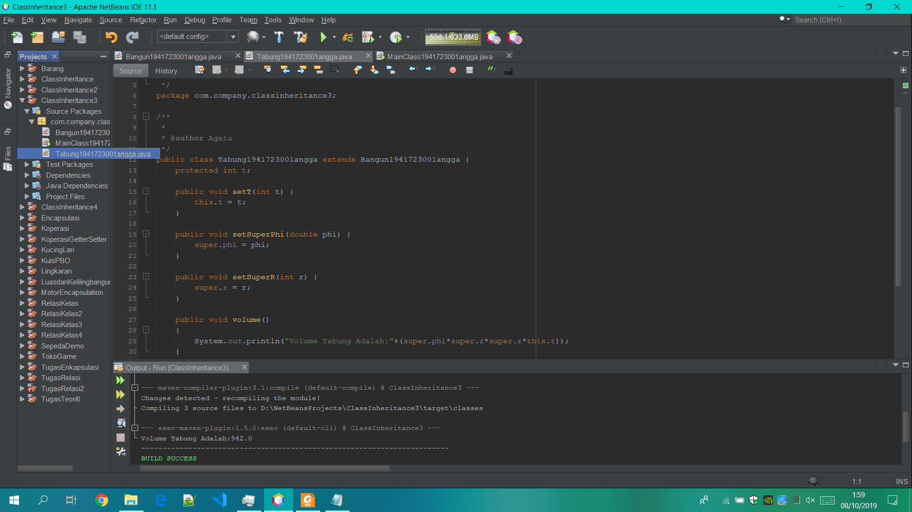
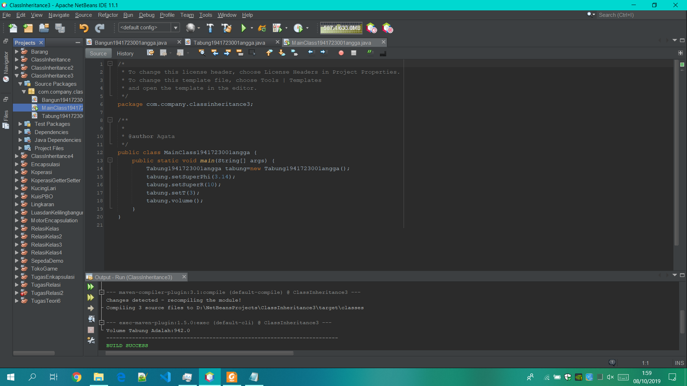
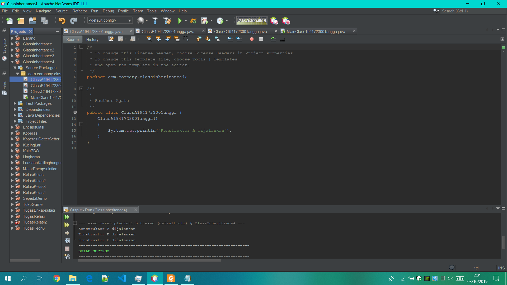
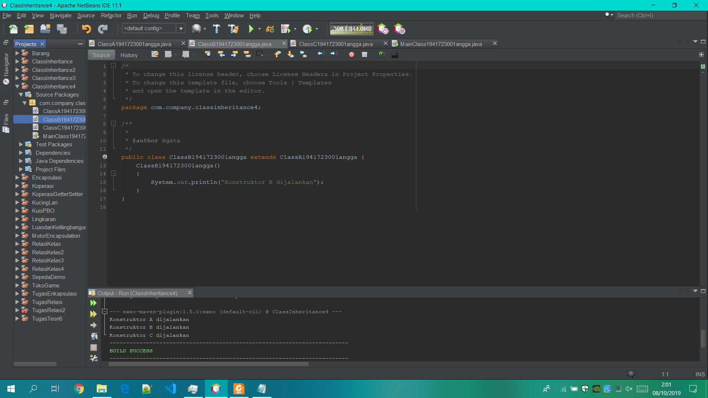
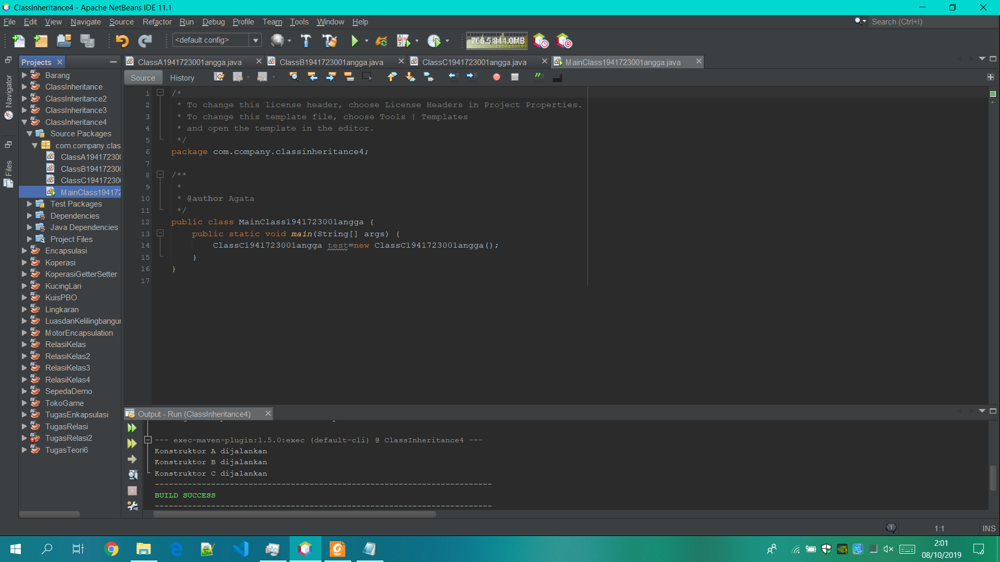

# Laporan Pratikum #5 - Inheritance

## Kompetensi

## Ringkasan Materi

## Percobaan

### Percobaan 1

Screenshot ClasA.java

Screenshot ClasB.java

Screenshot MainClass.java

link kode program : [ini link ke ClasA.java](../../src/5_Inheritance/ClasA1941723001Angga.java) 

link kode program : [ini link ke ClasB.java](../../src/5_Inheritance/ClasB1941723001Angga.java)

link kode program : [ini link ke MainClass.java](../../src/5_Inheritance/MainClass1941723001Angga.java)

### Pertanyaan

### Percobaan 2

Screenshot KelasA.java

Screenshot KelasB.java

Screenshot MainClass2.java

link kode program : [ini link ke KelasA.java](../../src/5_Inheritance/KelasA1941723001Angga21.java)

link kode program : [ini link ke KelasB.java](../../src/5_Inheritance/KelasB1941723001Angga.java)

link kode program : [ini link ke MainClass2.java](../../src/5_Inheritance/MainClass21941723001Angga.java)

### Pertanyaan

### Percobaan 3

Screenshot Bangun.java

Screenshot Tabung.java

Screenshot MainClass3.java

-link kode program : [ini link ke Bangun.java](../../src/5_Inheritance/Bangun1941723001Angga.java)

-link kode program : [ini link ke Tabung.java](../../src/5_Inheritance/Tabung1941723001Angga.java)

-link kode program : [ini link ke MainClass3.java](../../src/5_Inheritance/MainClass31941723001Angga.java)

## Pertanyaan

### Percobaan 4

Screenshot ClassA.java

Screenshot ClassB.java

Screenshot ClassC.java

Screenshot MainClass4.java

-link kode program : [ini link ke ClassA.java](../../src/5_Inheritance/ClassA1941723001Angga.java)

-link kode program : [ini link ke ClassB.java](../../src/5_Inheritance/ClassB1941723001Angga.java)

-link kode program : [ini link ke ClassC.java](../../src/5_Inheritance/ClassC1941723001Angga.java)

-link kode program : [ini link ke MainClass4.java](../../src/5_Inheritance/MainClass41941723001Angga.java)

### Pertanyaan

## Tugas

Screenshot Bandara.java

Screenshot BeliTiketBerangkat.java

Screenshot BeliTiketPulang.java

Screenshot DataClassA.java

Screenshot MainTugasRelasi.java

-link kode program : [ini link ke Bandara.java](../../src/5_Inheritance/Bandara1941723001Angga.java)

-link kode program : [ini link ke BeliTiketPergi.java](../../src/5_Inheritance/BeliTiketBerangkat1941723001Angga.java)

-link kode program : [ini link ke BeliTiketPulang.java](../../src/5_Inheritance/BeliTiketPulang1941723001Angga.java)

-link kode program : [ini link ke DataClassA.java](../../src/5_Inheritance/DataClassA1941723001Angga.java)

-link kode program : [ini link ke MainTugasRelasi.java](../../src/5_Inheritance/MainTugasRelasi1941723001Angga.java)

## Pernyataan Diri

Saya menyatakan isi tugas, kode program, dan laporan praktikum ini dibuat oleh saya sendiri. Saya tidak melakukan plagiasi, kecurangan, menyalin/menggandakan milik orang lain.

Jika saya melakukan plagiasi, kecurangan, atau melanggar hak kekayaan intelektual, saya siap untuk mendapat sanksi atau hukuman sesuai peraturan perundang-undangan yang berlaku.

Ttd,

***(Angga Rahmat Adriyadhi)***