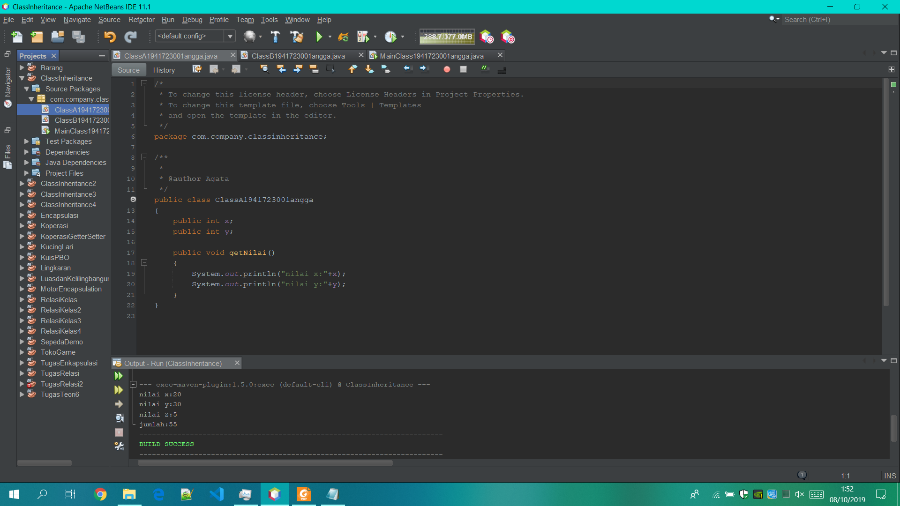

# Laporan Pratikum #5 - Inheritance

## Kompetensi
    1. Memahami  konsep  dasar  inheritance  atau  pewarisan.
    2. Mampu  membuat  suatu  subclass  dari  suatu  superclass  tertentu.
    3. Mampu  mengimplementasikan  konsep  single  dan  multilevel  inheritance.
    4. Mampu  membuat  objek  dari  suatu  subclass  dan  melakukan  pengaksesan  terhadap  atribut  dan  method  baik  yang  dimiliki  sendiri  atau  turunan  dari  superclass  nya.

## Ringkasan Materi
    Inheritance atau  pewarisan sifat merupakan  suatu  cara  untuk menurunkan  suatu  class  yang  lebih  umum  menjadi  suatu  class  yang  lebih  spesifik.  Inheritance  adalah  salah  satu ciri  utama  suatu  bahasa  program  yang  berorientasi  pada  objek.  Inti  dari  pewarisan  adalah  sifat  reusable  dari  konsep  object   oriented.   Setiap   subclass akan   “mewarisi”sifat   dari   superclass selama   bersifat   protected  ataupun public.

    Karakteristik   pada   super   class   akan   dimiliki   juga   oleh   subclassnya.   Terdapat   3   bentuk  pewarisan:   single inheritance,   multilevel   inheritance,   dan   multiple   inheritance.   Namun   yang   akan  dibahas  pada  jobsheet  ini adalah  single  inheritance  dan  multilevel  inheritance.

    1.	Single  Inheritance 
    Single  inheritance  adalah  Suatu  class  yang  hanya  mempunyai  satu  parent  class.

    2. Multilevel  Inheritance
    Multilevel   inheritance   adalah   Suatu   subclass   bisa   menjadi   superclass   bagi   class   yang   lain.

    Kata  kunci  super  dipakai  untuk  merujuk  pada  member  dari  parent  class.  Sebagaimana  kata  kunci   this   yang   dipakai untuk   merujuk   pada   member  dari   class   itu   sendiri.   Format   penulisannya  adalah  sebagai  berikut:

    super.namaAtribut
    Merujuk/mengakses  atribut  dari  parent  class /superclass

    super.namaMethod()
    Merujuk/memanggil  method  dari  parent  class /superclass

    super()
    Merujuk  /  memanggil  konstruktor  parent  class /superclass
    Hanya  bisa  digunakan  dibaris  pertama  dalam  kontruktor.

    super(parameter1,  parameter2,dst)
    Merujuk  /  memanggil  konstruktor  berparamter  dari  superklas

## Percobaan

    1. Buatlah  sebuah  class  parent/superclass  dengan  nama  ClassA.java
    2. Buatlah  sebuah  class  anak/subclass  dengan  nama ClassB.java
    3. Buatlah  class  Percobaan1.java  untuk  menjalankan  program  diatas!
    4. Jalankan  program  diatas,  kemudian  amati  apa  yang  terjadi!

### Percobaan 1

Screenshot ClasA.java

Screenshot ClasB.java

Screenshot MainClass.java

link kode program : [ini link ke ClasA.java](../../src/5_Inheritance/ClasA1941723001Angga.java) 

link kode program : [ini link ke ClasB.java](../../src/5_Inheritance/ClasB1941723001Angga.java)

link kode program : [ini link ke MainClass.java](../../src/5_Inheritance/MainClass1941723001Angga.java)

### Pertanyaan

    1.Pada  percobaan  1  diatas  program  yang  dijalankan  terjadi error,  kemudian  perbaiki  sehingga  program  tersebut  bisa  dijalankan  dan  tidak  error!

    2. Jelaskan  apa  penyebab  program pada  percobaan  1  ketika  dijalankan  terdapat  error!
    Jawab:Karena tidak ada kelas extends pada class B sehingga program tidak bisa di jalankan karena tidak bisa memanggil parent class

## Percobaan 2

    1. Buatlah  sebuah  class  parent/superclass  dengan  nama  ClassA.java
    2. Buatlah  sebuah  class  anak/subclass  dengan  nama  ClassB.java
    3. Buatlah  class  Percobaan2.java  untuk  menjalankan  program  diatas!
    4. Jalankan  program  diatas,  kemudian  amati  apa  yang  terjadi!

### Percobaan 2

Screenshot KelasA.java

Screenshot KelasB.java

Screenshot MainClass2.java

link kode program : [ini link ke KelasA.java](../../src/5_Inheritance/KelasA1941723001Angga21.java)

link kode program : [ini link ke KelasB.java](../../src/5_Inheritance/KelasB1941723001Angga.java)

link kode program : [ini link ke MainClass2.java](../../src/5_Inheritance/MainClass21941723001Angga.java)

### Pertanyaan

    1. Pada  percobaan  2 diatas  program  yang  dijalankan  terjadi error,  kemudian  perbaiki  sehingga  program  tersebut  bisa  dijalankan  dan  tidak  error!

    2. Jelaskan  apa  penyebab  program  pada  percobaan  1  ketika  dijalankan  terdapat  error!
    Jawab:Karena tidak ada kelas extends pada class B sehingga program tidak bisa di jalankan karena tidak bisa memanggil parent class

## Percobaan 3

    1.	Buatlah  sebuah  class  parent/superclass  dengan  nama  Bangun.java
    2.	Buatlah  sebuah  class  anak/subclass  dengan  nama  Tabung.java
    3.	Buatlah  class  Percobaan3.java  untuk  menjalankan  program diatas!
    4.	Jalankan  program  diatas!

### Percobaan 3

Screenshot Bangun.java

Screenshot Tabung.java

Screenshot MainClass3.java

-link kode program : [ini link ke Bangun.java](../../src/5_Inheritance/Bangun1941723001Angga.java)

-link kode program : [ini link ke Tabung.java](../../src/5_Inheritance/Tabung1941723001Angga.java)

-link kode program : [ini link ke MainClass3.java](../../src/5_Inheritance/MainClass31941723001Angga.java)

## Pertanyaan

    1. Jelaskan  fungsi   “super”  pada  potongan  program  berikut  di  class  Tabung!
    Jawab:Fungsi super pada class di atas berfungsi sebagai pemanggil class parent
    yaitu Class Bangun untuk di panggil ke class child yaitu Class tabung

    2. Jelaskan  fungsi  “super”  dan  “this”  pada  potongan  program  berikut  di  class  Tabung!
    Jawab:Fungsi super pada bagian bertujuan Untuk memanggil 
    Parent Class untuk di tampilkan
    Fungsi this pada bagian bertujuan untuk memanggil nilai class

    3. Jelaskan  mengapa  pada  class  Tabung  tidak  dideklarasikan atribut  “phi”  dan  “r”  tetapi  class  tersebut  dapat  mengakses  atribut  tersebut!
    Jawab:Karena Deklarasi "Phi" dan "r" merupakan class super sehingga tanpa di mendeklarasikan atribut tersebut dapat memanggil parent class ke lokasi class yang di beri super class

## Percobaan 4

    1.Buatlah  tiga  file  dengan  nama  ClassA.java  ,  ClassB.java  ,  dan  ClassC.java,  seperti  pada  kode  program  dibawah ini!
    ClassA.java
    ClassC.java
    
    2. Buatlah  class  Percobaan4.java  untuk  menjalankan  program  diatas!
    
    3. Jalankan  program  kemudian  amati  apa  yang  terjadi!

### Percobaan 4

Screenshot ClassA.java

Screenshot ClassB.java

Screenshot ClassC.java

Screenshot MainClass4.java

-link kode program : [ini link ke ClassA.java](../../src/5_Inheritance/ClassA1941723001Angga.java)

-link kode program : [ini link ke ClassB.java](../../src/5_Inheritance/ClassB1941723001Angga.java)

-link kode program : [ini link ke ClassC.java](../../src/5_Inheritance/ClassC1941723001Angga.java)

-link kode program : [ini link ke MainClass4.java](../../src/5_Inheritance/MainClass41941723001Angga.java)

### Pertanyaan

    1. Pada  percobaan  4  sebutkan  mana  class  yang  termasuk  superclass  dan  subclass,  kemudian  jelaskan  alasannya!
    Jawab:superclass pada pratikum 4 adalah CLass A 
    subcalass pada pratikum 4 adalah class b dan class c

    2. Ubahlah  isi  konstruktor  default  ClassC  seperti  berikut:
    Tambahkan  kata  super()  di  baris  Pertaman  dalam  konstruktor  defaultnya.  Coba  jalankan  kembali  class  Percobaan4  dan  terlihat  tidak  ada  perbedaan  dari  hasil  outputnya!
    Jawab:

    3. Ublah  isi  konstruktor  default  ClassC  seperti  berikut:
	Ketika  mengubah  posisi  super()  dibaris  kedua  dalam  kontruktor  defaultnya  dan  terlihat  ada  error.  Kemudian  kembalikan  super()  kebaris  pertama  seperti  sebelumnya,  maka  errornya  akan  hilang.Perhatikan  hasil  keluaran  ketika class  Percobaan4  dijalankan.  Kenapa  bisa  tampil  output  seperti  berikut  pada  saat  instansiasi  objek  test  dari  class  ClassC Jelaskan  bagaimana  urutan  proses  jalannya  konstruktor  saat  objek  test  dibuat!
    Jawab:Pada saat program tersebut dikompilasi, maka
    kompiler Java akan menambahkan :
    konstruktor class Parent
    konstruktor class Child
    pemanggilan konstruktor class Parent di kostruktor class Child

    4. Apakah  fungsi  super()  pada  potongan  program  dibawah  ini  di  ClassC!
    Jawab:Sebagai pemanggilan konstruktor class Parent di kostruktor
    class Child

## Percobaan 5
### Percobaan 5
[MAAF PAK MENYUSUL]

## Percobaan 6
### Percobaan 6
[MAAF PAK MENYUSUL]

## Tugas
[MAAF PAK MENYUSUL]

## Pernyataan Diri

Saya menyatakan isi tugas, kode program, dan laporan praktikum ini dibuat oleh saya sendiri. Saya tidak melakukan plagiasi, kecurangan, menyalin/menggandakan milik orang lain.

Jika saya melakukan plagiasi, kecurangan, atau melanggar hak kekayaan intelektual, saya siap untuk mendapat sanksi atau hukuman sesuai peraturan perundang-undangan yang berlaku.

Ttd,

***(Angga Rahmat Adriyadhi)***