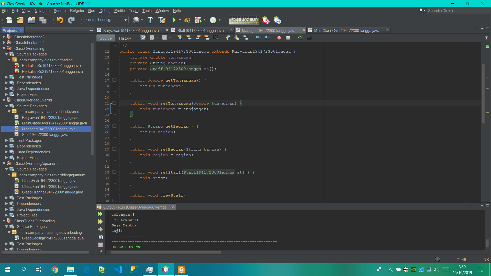

# Laporan Pratikum #6 - Overloading Dan Overriding

## Kompetensi
    Setelah menempuh pokok bahasan ini, mahasiswa mampu :
    a. Memahami konsep overloading dan overriding,
    b. Memahami perbedaan overloading dan overriding,
    c. Ketepatan dalam mengidentifikasi method overriding dan overloading
    d. Ketepatan dalam mempraktekkan instruksi pada jobsheet
    e. Mengimplementasikan method overloading dan overriding.

## Ringkasan Materi
    Overloading
    adalah menuliskan kembali method dengan nama yang sama pada suatu class. Tujuannya
    dapat memudahkan penggunaan/pemanggilan method dengan fungsionalitas yang mirip.
    Untuk aturan pendeklarasian method Overloading sebagai berikut:
    a.Nama method harus sama.
    b.Daftar parameter harus berbeda.
    c.Return type boleh sama, juga boleh berbeda.

    Overriding
    adalah Sublass yang berusaha memodifkasi tingkah laku yang diwarisi dari superclass.
    Tujuannya subclass dapat memiliki tingkah laku yang lebih spesifik sehingga dapat
    dilakukan dengan cara mendeklarasikan kembali method milik parent class di subclass.
    eklarasi method pada subclass harus sama dengan yang terdapat di super class.
    Kesamaan pada:
    a.Nama
    b.Return type (untuk return type : class A atau merupakan subclass dari class A)
    c.Daftar parameter (jumlah, tipe dan urutan)

### Percobaan 1
    Untuk kasus contoh berikut ini, terdapat tiga kelas, yaitu Karyawan, Manager, dan Staff.
    Class Karyawan merupakan superclass dari Manager dan Staff dimana subclass Manager dan
    Staff memiliki method untuk menghitung gaji yang berbeda.

Screenshot Karyawan.java

Screenshot Staff.java

Screenshot Manager.java

Screenshot DosenOverloadOveride.java

link kode program : [ini link ke Karyawan.java](../../src/6_Overloading_dan_Override/Karyawan1941723001angga.java) 

link kode program : [ini link ke Staff.java](../../src/6_Overloading_dan_Override/Staff1941723001angga.java)

link kode program : [ini link ke Manager.java](../../src/6_Overloading_dan_Override/Manager1941723001angga.java)

link kode program : [ini link ke DosenOverloadOveride.java](../../src/6_Overloading_dan_Override/DosenOverloadOveride1941723001angga.java)

### Latihan

Screenshot PerkalianKu.java

link kode program : [ini link ke PerkalianKu.java](../../src/6_Overloading_dan_Override/PerkalianKu1941723001angga.java)

### Pertanyaan

    1.Dari source coding diatas terletak dimanakah overloading?
    Jawab
Screenshot PerkaliankuOverloading.java

link kode program : [ini link ke PerkaliankuOverloading.java](../../src/6_Overloading_dan_Override/Perkalianku1941723001angga.java)

    2.Jika terdapat overloading ada berapa jumlah parameter yang berbeda?
    Jawab
Screenshot PerkaliankuOverloading.java

link kode program : [ini link ke PerkaliankuOverloading.java](../../src/6_Overloading_dan_Override/Perkalianku1941723001angga.java)

### TerusanLatihan Ke 2

Screenshot Perkalianku2.java

link kode program : [ini link ke Perkalianku2.java](../../src/6_Overloading_dan_Override/ClassPerkalianku1941723001angga.java)

### Pertanyaan
    1.Dari source coding diatas terletak dimanakah overloading?
    Jawab

Screenshot Perkalianku2.java

link kode program : [ini link ke Perkalianku2.java](../../src/6_Overloading_dan_Override/ClassPerkalianku1941723001angga.java)

    2.Jika terdapat overloading ada berapa tipe parameter yang berbeda?
    Jawab

Screenshot Perkalianku2Overloading.java

link kode program : [ini link ke Perkalianku2Overloading.java](../../src/6_Overloading_dan_Override/ClassPerkalianku31941723001angga.java)

### TerusanLatihan Ke 3

Screenshot Ikan.java

link kode program : [ini link ke Ikan.java](../../src/6_Overloading_dan_Override/ClassIkan1941723001angga.java)

Screenshot Piranha.java

link kode program : [ini link ke Piranha.java](../../src/6_Overloading_dan_Override/ClassPiranha1941723001angga.java)

Screenshot DosenOverridingAquarium.java

link kode program : [ini link ke DosenOverridingAquarium.java](../../src/6_Overloading_dan_Override/ClassFish1941723001angga.java)

### Pertanyaan
    1.Dari source coding diatas terletak dimanakah overriding?
    Jawab

    2.Jabarkanlah apabila sourcoding diatas jika terdapat overriding?
    Jawab

## Tugas
### Overloading
    Implementasikan konsep overloading pada class diagram dibawah ini : 
Screenshot MainClassTugasOverloading.java

link kode program : [ini link ke MainClassTugasOverloading.java](../../src/6_Overloading_dan_Override/ClassSegitiga1941723001angga.java)

### Overriding
    Implementasikan class diagram dibawah ini dengan menggunakan teknik dynamic
    method dispatch :

Screenshot Manusia.java

Screenshot Mahasiswa.java

Screenshot Dosen.java

link kode program : [ini link ke Manusia.java](../../src/6_Overloading_dan_Override/ClassManusia1941723001angga.java) 

link kode program : [ini link ke Mahasiswa.java](../../src/6_Overloading_dan_Override/ClassMahasiswa1941723001angga.java)

link kode program : [ini link ke Dosen.java](../../src/6_Overloading_dan_Override/ClassDosen1941723001angga.java)

## Pernyataan Diri

Saya menyatakan isi tugas, kode program, dan laporan praktikum ini dibuat oleh saya sendiri. Saya tidak melakukan plagiasi, kecurangan, menyalin/menggandakan milik orang lain.

Jika saya melakukan plagiasi, kecurangan, atau melanggar hak kekayaan intelektual, saya siap untuk mendapat sanksi atau hukuman sesuai peraturan perundang-undangan yang berlaku.

Ttd,

***(angga Rahmat Adriyadhi)***