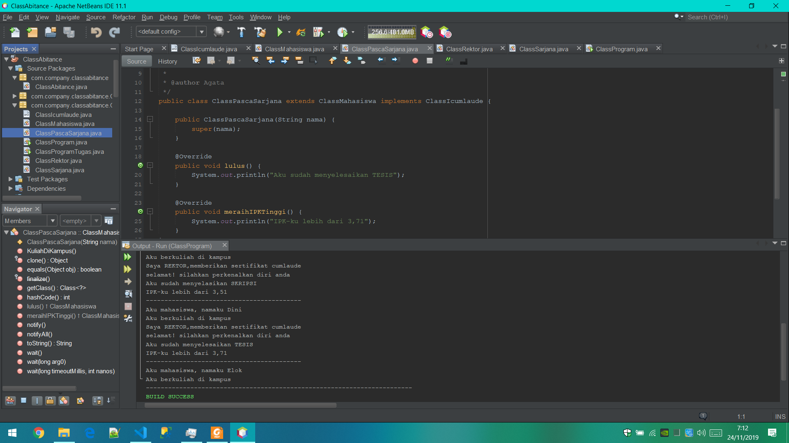

# Laporan Pratikum #7 - Abstract Class dan Interface

## Kompetensi

    Setelah menyelesaikan lembar kerja ini mahasiswa diharapkan mampu:
    1. Menjelaskan maksud dan tujuan penggunaan Abstract Class;
    2. Menjelaskan maksud dan tujuan penggunaan Interface;
    3. Menerapkan Abstract Class dan Interface di dalam pembuatan program.

## Ringkasan Materi

    Abstract Class
    Abstract Class adalah class yang tidak dapat diinstansiasi namun dapat di-extend. Abstract class baru dapat dimanfaatkan ketika ia di-extend.

    Interface
    Interface adalah struktur data yang hanya berisi abstract methods. Tidak ada apa-apa selain method abstract pada interface, termasuk atribut getter dan setter.

### Percobaan 1

Screenshot ClassHewan.java

Screenshot ClassIkan.java

Screenshot ClassKucing.java

Screenshot ClassOrang.java

Screenshot ClassProgramMain.java

link kode program : [ini link ke ClassHewan.java](../../src/7_Abstract_Class_dan_Interface/ClassHewan.java)

link kode program : [ini link ke ClassIkan.java](../../src/7_Abstract_Class_dan_Interface/ClassIkan.java)

link kode program : [ini link ke ClassKucing.java](../../src/7_Abstract_Class_dan_Interface/ClassKucing.java)

link kode program : [ini link ke ClassOrang.java](../../src/7_Abstract_Class_dan_Interface/ClassOrang.java)

link kode program : [ini link ke ClassProgramMain.java](../../src/7_Abstract_Class_dan_Interface/ClassProgram.java)

### Percobaan 1
Screenshot ClassMahasiswa.java

Screenshot ClassSarjana.java

Screenshot ClassPascaSarjana.java

Screenshot ClassRektor.java

Screenshot ClassProgram.java

link kode program : [ini link ke ClassMahasiswa.java](../../src/7_Abstract_Class_dan_Interface/ClassMahasiswa.java) 

link kode program : [ini link ke ClassSarjana.java](../../src/7_Abstract_Class_dan_Interface/ClassSarjana.java)

link kode program : [ini link ke ClassPascaSarjana.java](../../src/7_Abstract_Class_dan_Interface/ClassPascaSarjana.java)

link kode program : [ini link ke ClassRektor.java](../../src/7_Abstract_Class_dan_Interface/ClassRektor.java)

link kode program : [ini link ke ClassProgram.java](../../src/7_Abstract_Class_dan_Interface/ClassProgram1.java)

## Pernyataan Diri

Saya menyatakan isi tugas, kode program, dan laporan praktikum ini dibuat oleh saya sendiri. Saya tidak melakukan plagiasi, kecurangan, menyalin/menggandakan milik orang lain.

Jika saya melakukan plagiasi, kecurangan, atau melanggar hak kekayaan intelektual, saya siap untuk mendapat sanksi atau hukuman sesuai peraturan perundang-undangan yang berlaku.

Ttd,

**_(angga Rahmat Adriyadhi)_**
