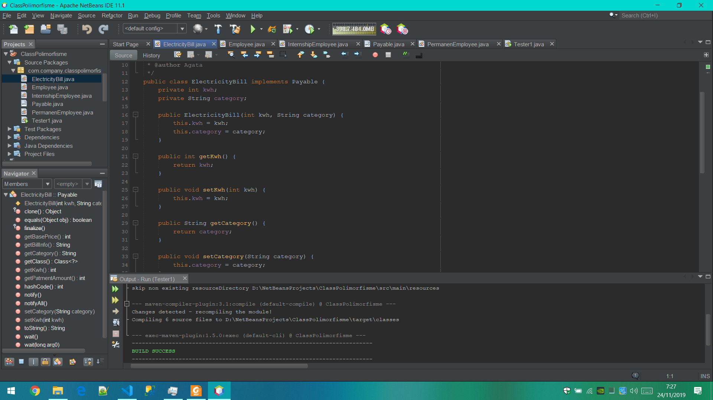

# Laporan Pratikum #8 - Polimorfisme

## Kompetensi
   Setelah melakukan percobaan pada jobsheet ini, diharapkan mahasiswa mampu:
    a. Memahami konsep dan bentuk dasar polimorfisme
    b. Memahami konsep virtual method invication
    c. Menerapkan polimorfisme pada pembuatan heterogeneous collection
    d. Menerapkan polimorfisme pada parameter/argument method
    e. Menerapkan object casting untuk meng-ubah bentuk objek

## Ringkasan Materi
    Polimorfisme merupakan kemampuan suatu objek untuk memiliki banyak
    bentuk. Penggunaan polimorfisme yang paling umum dalam OOP terjadi
    ketika ada referensi super class yang digunakan untuk merujuk ke objek dari sub class. Dengan kata lain, ketika ada suatu objek yang dideklarasikan dari super class, maka objek tersebut bisa diinstansiasi sebagai objek dari sub class. Dari uraian tersebut bisa dilihat bahwa konsep polimorfisme bisa diterapkan pada class-class yang memiliki relasi inheritance (relasi generalisasi atau IS-A).

### Percobaan 1
    Screenshot ClassElectricityBill.java

    Screenshot ClassEmployee.java

    Screenshot ClassInternshipEmployee.java

    Screenshot ClassPayable.java

    Screenshot ClassPermanenEmployee.java

    Screenshot ClassTester1.java

link kode program : [ini link ke ClassElectricityBill.java](../../src/8_Polimorfisme/ElectricityBill.java) 

link kode program : [ini link ke ClassEmployee.java](../../src/8_Polimorfisme/Employee.java)

link kode program : [ini link ke ClassInternshipEmployee.java](../../src/8_Polimorfisme/InternshipEmployee.java)

link kode program : [ini link ke ClassPayable.java](../../src/8_Polimorfisme/Payable.java)

link kode program : [ini link ke ClassPermanenEmployee.java](../../src/8_Polimorfisme/PermanenEmployee.java)

link kode program : [ini link ke ClassTester1.java](../../src/8_Polimorfisme/Tester1.java)

### Percobaan 

### Latihan

### Pertanyaan

### TerusanLatihan Ke 2

### Pertanyaan

### TerusanLatihan Ke 3

### Pertanyaan

## Tugas

## Pernyataan Diri

Saya menyatakan isi tugas, kode program, dan laporan praktikum ini dibuat oleh saya sendiri. Saya tidak melakukan plagiasi, kecurangan, menyalin/menggandakan milik orang lain.

Jika saya melakukan plagiasi, kecurangan, atau melanggar hak kekayaan intelektual, saya siap untuk mendapat sanksi atau hukuman sesuai peraturan perundang-undangan yang berlaku.

Ttd,

***(angga Rahmat Adriyadhi)***